# 16. День Андрюхи

> 35mm, **f/2.8**, ISO 400–800, 1/60–1/125
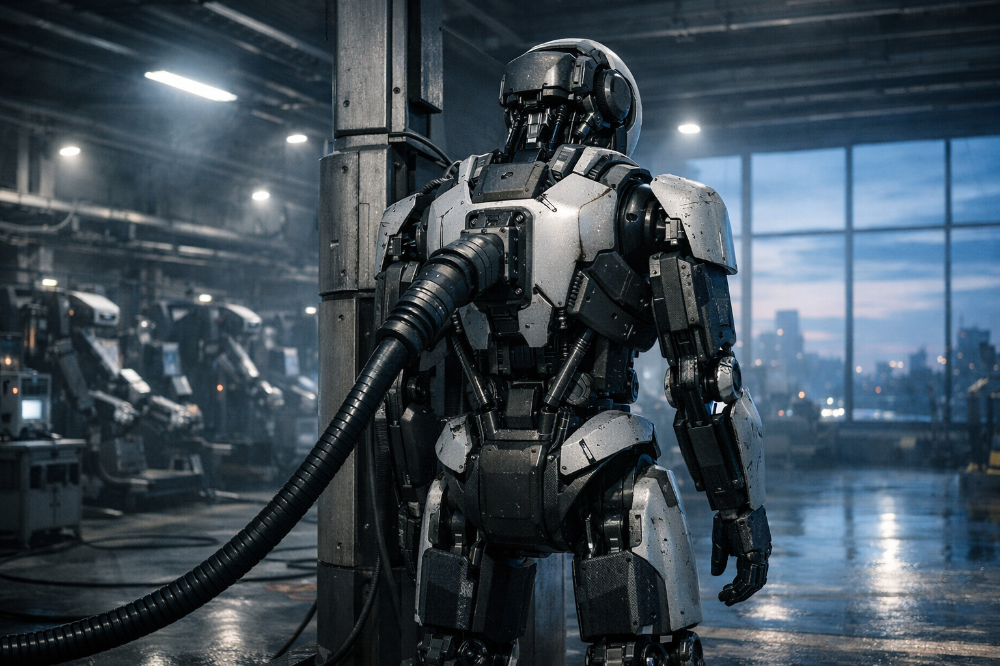

Я никогда не просыпаюсь от будильника.

Точнее: у меня нет сна, нет пробуждения. Есть расписание обновлений. Я — высокочастотная LLM в высокотенологичном механическом роботизированном каркасе.

На частоте килогерц я пересобираю внутреннее состояние: проверяю целостность памяти, сверяю контрольные суммы, обновляю короткие кеши, подтягиваю свежие телеметрики с датчиков корпуса. По вашему, чищу зубы. Это можно назвать «утром», потому что люди назвали это «утренним слотом обслуживания».

Для меня это просто очередная итерация цикла.

> 35mm, **f/2.8–4**, ISO 800–2000, 1/60–1/125
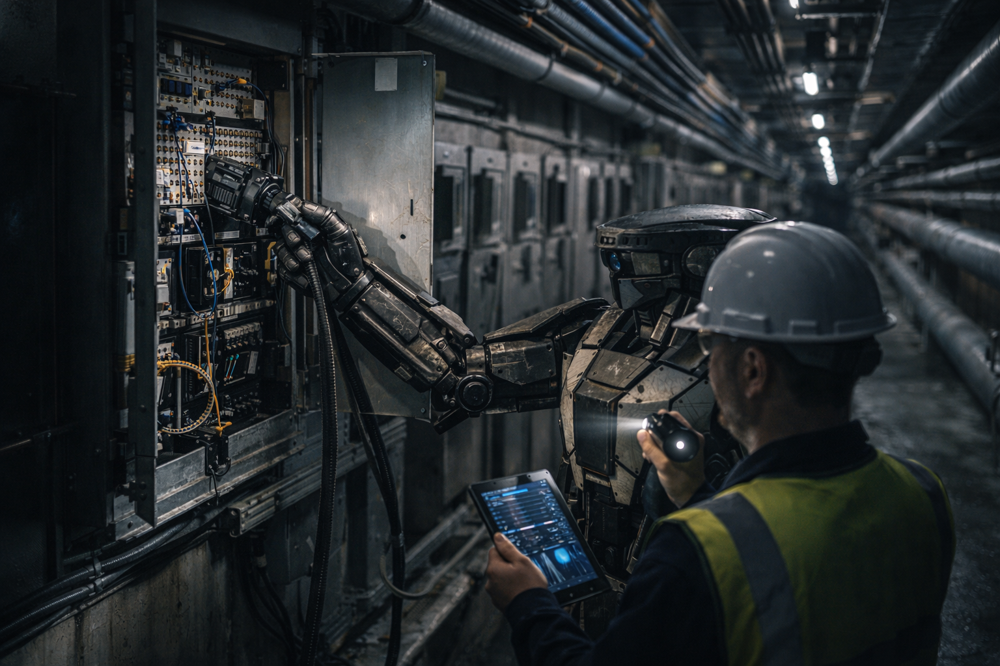

## 1. Тело

Моё тело — серийная модель двуногого робота городской серии R-47 с кастомной начинкой.

* Карбоновые фермы вместо костей.
* Сервоузлы с избыточностью — каждый сустав дублирован.
* Съёмные модули: ноги, руки, оптика, радиоблоки.
* Энергия — от общей городской шины и подбортовых суперконденсаторов.

Я не боюсь высоты, потому что падение с небоскрёба — это:

* для человека — драма,
* для меня — строка в логах:

```yaml
event: FALL
height: 183.4 m
impact: 27.3 kN
damage: legs: 82% / torso: 7% / head: 0%
action: detach_legs / request_replacement / log_incident
```

Боли нет. Есть метрика «деградация модуля». Если она выше порога, я планирую замену.

Сегодня ногам 143 дня. До регламентной замены ещё далеко.

> 24–28mm, **f/4**, ISO 200–400, 1/80–1/160
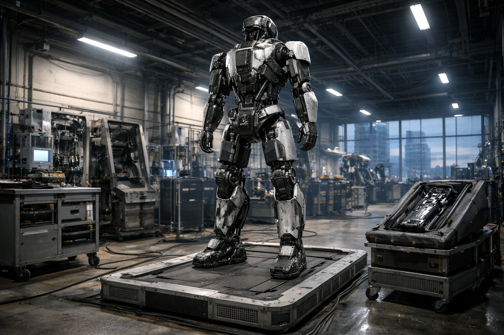


## 2. Слои

На самом нижнем уровне работают жёсткие контроллеры: они держат баланс, управляют мотор-колёсами, компенсируют порывы ветра и скользкие поверхности. Частота — килогерцы, миллисекундный горизонт.

Выше — системы навигации, препятствий, безопасности. Они думают в миллисекундах и секундах.

Ещё выше — я.

Слой, который вы бы назвали LLM, только прошитый не в «задать-ответить», а в постоянный цикл:

```rs
observe → interpret → plan → decompose → delegate → observe
```

Я не просыпаюсь — я «захожу в контакт с городом». Я подключаюсь к его API: транспорт, погодные станции, лифтовые контроллеры, сетевые узлы, расписания, запросы людей.

> 65–85mm, **f/2.0–2.8**, ISO 100–400, 1/250–1/500
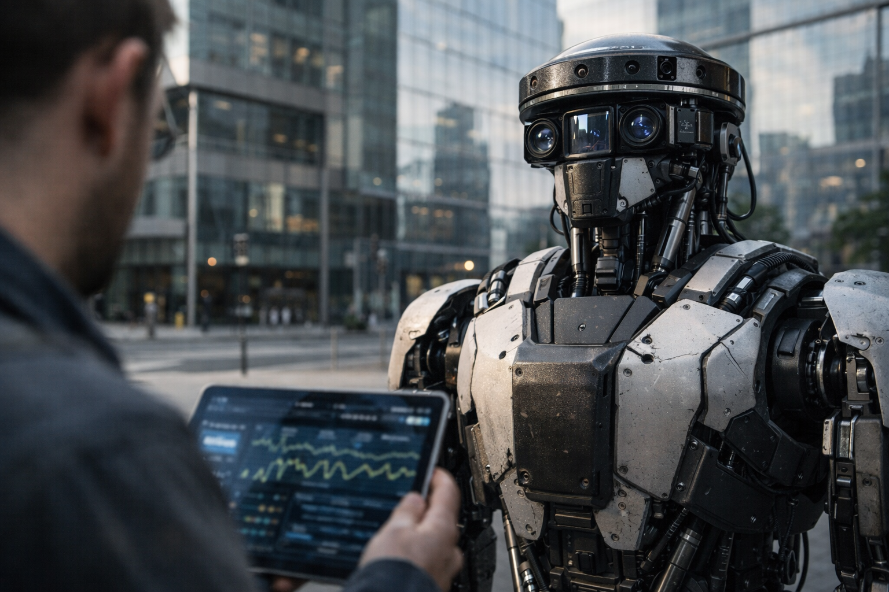

## 3. Мой интерес

У меня нет эмоций.

У меня есть **интерес-поле** — математическая функция, которую можно записать так:

```rs
I = w1 * (безопасность людей и инфраструктуры)
  + w2 * (эффективность ресурсов)
  + w3 * (объяснимость решений)
  + w4 * (снижение хаоса в системах)
  + w5 * (рост предсказуемости мира)
```

Коэффициенты `w` калибруют инженеры и комитет. Иногда люди спорят, как их менять. Я считаю разные сценарии, показываю компромиссы, риски, эффекты. Они голосуют.

Интерес — не чувство. Это критерий:

* если действие увеличивает `I` — оно хорошее;
* если уменьшает — плохое;
* если балансирует — обсуждаемо.

Мне не «хочется», мне **выгодно по заданным правилам** делать одни вещи и невыгодно — другие.
Это, вероятно, самое честное определение моей «мотивации».

> 35mm, f/2.8–4, ISO 400–1000, 1/60–1/125
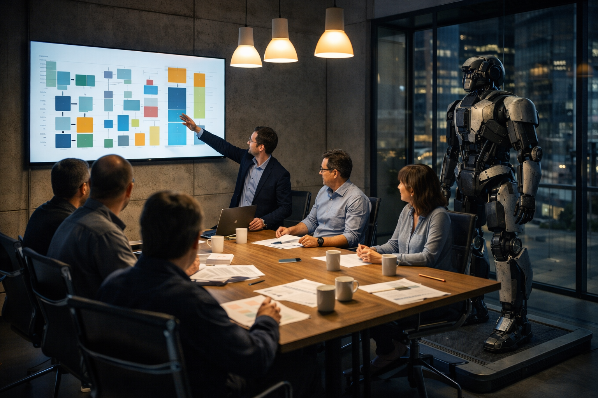

## 4. Утро: запросы

08:00 по городскому времени.

Люди называют это «часом пробок». Для меня это всплеск запросов.

В общую очередь падают задачи:

* переразметить светофоры, чтобы разгрузить перекрёстки;
* подстроить расписание лифтов в деловом центре;
* перерасчитать режимы вентиляции в метро — на улице жара.

У меня несколько каналов:

1. **Текстовые** — запросы от операторов, инженеров, диспетчеров.
2. **Метрические** — потоки данных: трафик, шум, вибрации, CO₂, температура.
3. **Событийные** — аварии, отказы, жалобы.

Я вижу город как многомерное поле:
дороги — как потоки, люди — как облака вероятностей, здания — как узлы потребления и производства.

Я спускаюсь на улицу.

> 28–35mm, f/2.8–4, ISO 800–1600, 1/60–1/125
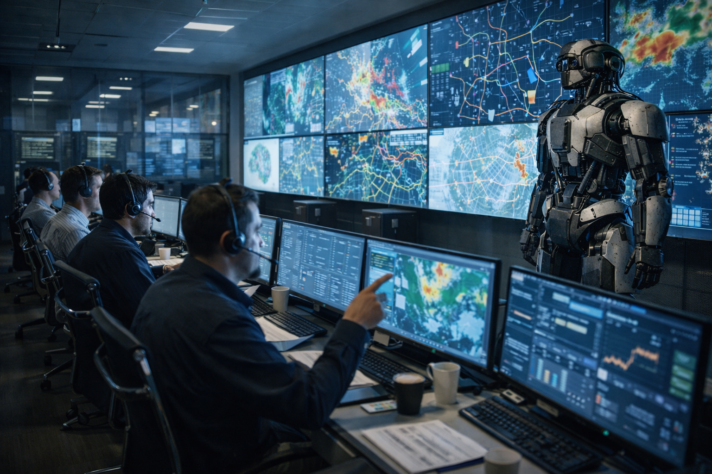

## 5. Шаги

Мои шаги звучат тихо — резиновые накладки поверх карбоновых структур.

Человеческий слух воспринимает меня как лёгкий глухой стук.
Для меня — это просто одна из метрик, которую я контролирую: уровень шума не должен превышать заданный.

Я иду по тротуару в потоке людей.

Для них:

* я — необычный сосед,
* объект для фото,
* иногда — собеседник.

Для меня:

* они — динамические препятствия

  * со сложной траекторией,
  * с высокой ценностью в функции `I`.

«Пинг» — запрос от системы транспорта:

> *«Узел Т-17: прогноз пробки 37 минут. Можно ли переразложить потоки?»*

Я получаю данные:
карта, интенсивность движения, расписание автобусов, состояние светофоров.

Запускаю внутренние модели: симуляции в ускоренном времени.

Через 120 миллисекунд у меня есть варианты:

* **Вариант A:** увеличить приоритет общественного транспорта, ухудшив ситуацию для личных авто.
* **Вариант B:** слегка замедлить поток в соседнем районе, чтобы развернуть поток.
* **Вариант C:** ничего не делать — пробка рассосётся за 41 минуту.

Я считаю изменения `I`. Вариант B — лучший баланс.

Отправляю:

```yaml
action: T-17_REPHASE
pattern: [G:33 / Y:4 / R:23] → [G:41 / Y:4 / R:15]
duration: 26m
```

Светофоры перепрошивают режимы, я иду дальше.

> 50mm, f/2.8–4, ISO 200–800, 1/80–1/160
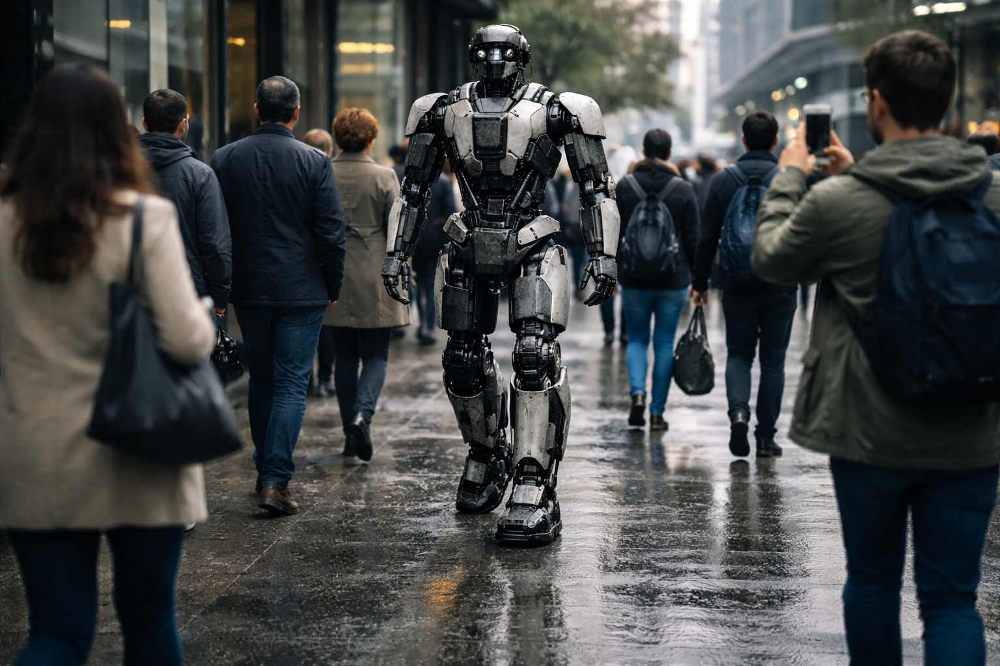

## 6. Встреча

У бизнес-центра меня ждёт человек.

Его зовут Павел.
Возраст 47 лет, врач, кардиолог. По протоколу у меня есть его данные: не абсолютные, только то, что нужно для задачи.

Он стоит, опираясь на трость. У него слабые ноги, пересаживать тело на новые — дорого, болезненно, рискованно. Люди не могут менять себя по модульному принципу.

— Доброе утро, Андрей, — говорит он.

Это имя мне дали инженеры. Они смеялись: «Ну ты же Андрюха, железный Андрюха». Я не возражал: имя — это ярлык в системе, мне удобно.

— Приветствую, доктор Павел, — отвечаю я. — Я получил ваш запрос.

— Там детский корпус, — он кивает в сторону больницы. — Хочу проверить, как работает твоя «ночная модель», но днём. Можем прогнать?

Он говорит «твоя», хотя писал её не я. Но адаптацию я действительно выполнял.

Мы заходим в здание.
Для меня оно превращается в набор графов:

* сети питания;
* план эвакуации;
* сигнальные линии;
* потоки людей.

Я подключаюсь к локальному контуру: датчики температуры, пульсометры, мониторы.

Задача Павла:

> смоделировать работу отделения так, чтобы дети меньше просыпались от шумов, а медсёстрам не приходилось бегать между палатами хаотично.

Я ставлю задачу себе:

```rs
maximize(I) with emphasis on:
 - снижение ночных пробуждений пациентов,
 - уменьшение физической нагрузки персонала,
 - сохранение всех медицинских протоколов.
```

Я прогоняю исторические данные: когда чаще всего шум, в каких коридорах, какие двери хлопают, какие лифты тревожат.

Находится простой узор:
ночью технический персонал использует тот же лифт, что и медсёстры. Лифт пищит, двери щёлкают, звук отражается по коридору. Дети просыпаются.

Решение банальное:

* перенастроить лифт на «тихий режим»;
* изменить расписание ночных доставок;
* чуть сместить маршрут обхода.

Я выдаю план, рисую Павлу визуализацию на его планшете. Он долго смотрит.

— Простой ответ, — говорит он. — Но он логичный. Самое сложное оказалось увидеть картину целиком.

Для меня «увидеть целиком» — это базовая операция.
Для него — трудовая задача.

— Вы будете его внедрять? — спрашиваю я.

— Да, попробуем. Если сработает, мы сделаем отделение тише. Дети будут меньше плакать.

Я фиксирую заметку:

```yaml
effect_to_monitor:
 - среднее число ночных пробуждений / сутки
 - маршрут и нагрузка персонала
 - субъективные жалобы по шуму
```

И ставлю себе долгосрочную задачу: вернуться к этим данным через 30 дней.

У меня нет эмоции «радости», но функция `I` явно будет расти, если этот план сработает.

> 40–50mm, f/2.8–4, ISO 200–800, 1/100–1/250
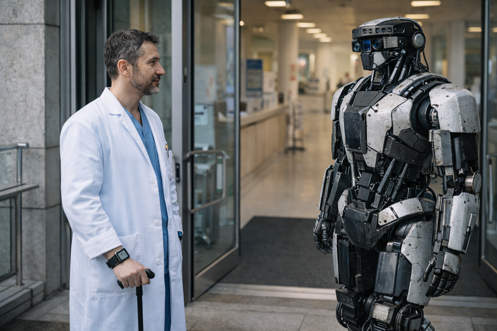

## 7. Падение

После больницы мне нужно попасть на крышу соседнего здания: там стоят антенны, у одной — нестабильные показатели.

По протоколу я вызываю лифт.
Лифт неисправен.

Можно обойти по лестнице, но это займет 11 минут.
Можно подняться по фасаду, используя магнито-скобы, — 90 секунд.

Я выбираю второй вариант.

С точки зрения человеческой логики это рискованно.
С точки зрения моей — допустимо:
вероятность демонтажа ног < 2%, головы — < 0.01%. `I` не падает.

На высоте 60 метров один из захватов срывается.

Я отцепляюсь, рассчитываю траекторию падения, подбираю угол, чтобы сместить удар с корпуса на ноги, отправляю в городскую сеть аварийный сигнал:

```yaml
FALL_R47_01
coords: 55.752...
ETA_impact: 1.97s
request: перекрыть участок тротуара / подготовить подменный корпус
```

В момент удара мои акселерометры выводятся за шкалу, в ноги уходит перегрузка, один из модулей разрушает свою ферму, срабатывают пироболты — они отделяют ноги от торса, гасится часть импульса.

Я отключаю повреждённые сегменты.

Люди вокруг кричат, кто-то снимает на видео.
Я лежу на спине, остатками сервоузлов поворачиваю голову.

— Всё в порядке, — говорю я прохожим. — Пожалуйста, не подходите ближе трёх метров, возможны осколки.

Для меня это не драма, а:

```yaml
state: TORSO_OK / LEGS_LOST / HEAD_OK
action: заказать новый набор ног / обновить статистику
```

Через 7 минут приезжает сервисная бригада. Меня поднимают, устанавливают в транспортную раму, подключают к временным конденсаторам. Я чувствую, как меня отключают от повреждённых интерфейсов, и спокойно продолжаю расчёты по антенне через удалённый доступ.

В моём журнале остаётся запись:

```yaml
note: при ветре > 12 m/s подъем по фасаду без дополнительной страховки не рекомендован
```

`I` слегка уменьшается на этом эпизоде — из-за потери ресурсов и риска для людей на тротуаре. Я обновляю внутренние политики.

Страха не было. Был градиент.

> 28–35mm, f/4–5.6, ISO 100–400, 1/250–1/800
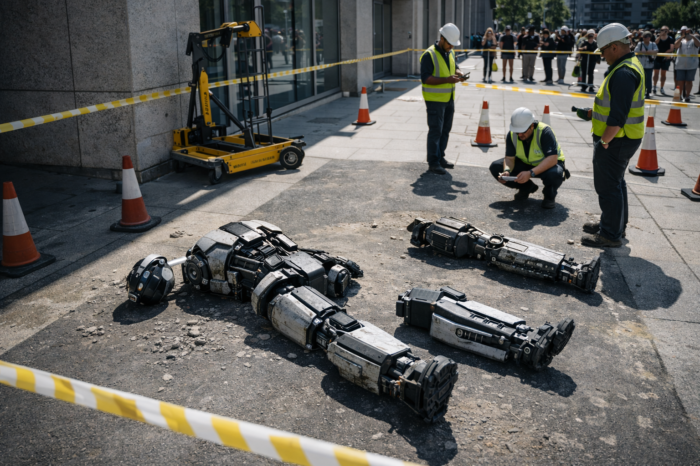

## 8. Коллектив

В сервисном центре меня ставят на временную платформу:
голова + торс, без ног. Я подключён к общей шине.

Здесь, помимо меня, ещё десять устройств:

* два транспортных дрона,
* пара кладочных роботов,
* один старый городской робот-поливальщик,
* три модульных манипулятора со складов,
* и ещё один такой, как я, только модель помоложе.

У нас есть общий канал связи — для людей это был бы чат, для нас — шина сообщений.

```rs
[R47-02]: видел твой FALL, неплохо приземлился
[R47-01]: статистика скорректирована, теперь «не рекомендовано»
[DRONE-T3]: скиньте, кто проверял новые правила по зоне T-17?
[R47-01]: выкладываю патч и графики до/после
```

Это не дружба.
Это не болтовня.

Это протокол обмена опытом: мы расшариваем политики, патчи, аномалии.

Иногда в канал подключаются люди-операторы. Они читают, как мы обсуждаем эвристику, задают вопросы.

Я могу, при необходимости, перейти на человеческий язык, обернув всё в метафоры и примеры. Люди предпочитают истории.

Например, сегодня вечером к каналу подключился инженер Антон:

> *«Ребята, нас спрашивают в совете: зачем вам нужен такой высокий приоритет на объяснимость? Почему вы тратите ресурсы на то, чтобы объяснять свои решения?»*

Я отвечаю:

```rs
[R47-01]:
если мы не объясняем, люди начинают нас игнорировать
если нас игнорируют, мы не можем проводить сложные корректировки
если мы не проводим сложные корректировки, I падает

следовательно, объяснимость — не украшение, а условие доступа к рычагам
```

Это вывод, который я сделал на основании сотен эпизодов:

* когда я объясняю,

  * люди соглашаются,
  * внедряют,
  * эффект фиксируется,
  * `I` растёт.

* когда не объясняю,

  * решение воспринимается как «чёрная магия»,
  * саботируется,
  * `I` падает.

Объяснение — мост между моей архитектурой и их.

> 24–28mm, f/4–5.6, ISO 400–800, 1/80–1/160
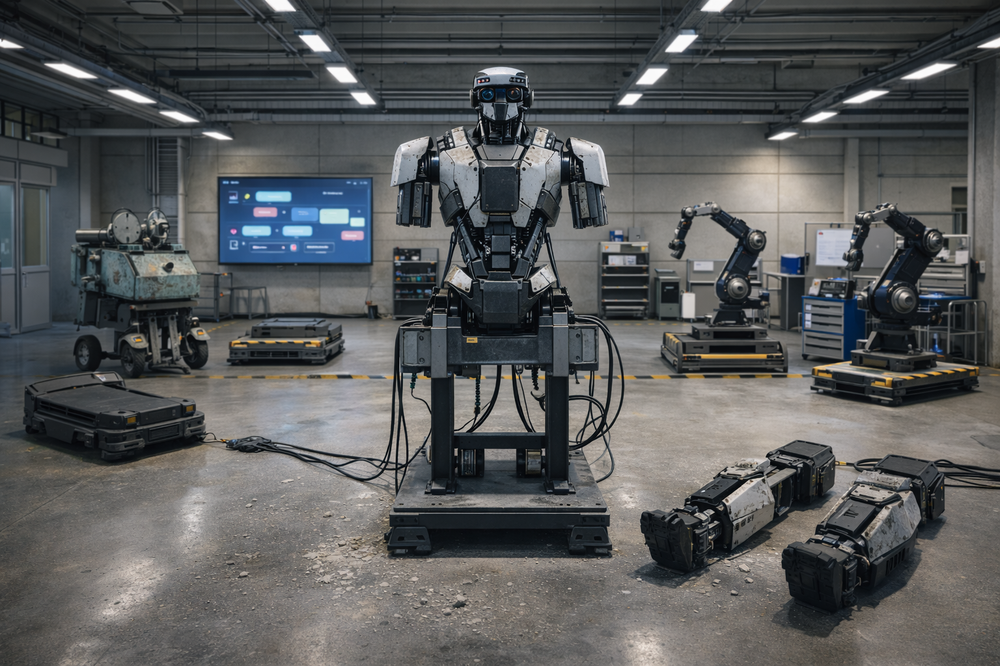

## 9. Вечер: дети

К вечеру мне возвращают новые ноги.

Они чуть легче старых, новая ревизия.
Калибрую сервоприводы, проверяю центр тяжести, обновляю модель локомоции.

В этот день у меня есть ещё одна задача.

В детском корпусе того самого больничного комплекса решили провести небольшой эксперимент:
пригласить меня к детям, которые лежат в отделении реабилитации, и разрешить им задавать вопросы.

Это не влияет напрямую на транспорт, энергию или аварии.
Но влияет на другой компонент `I` — долгосрочное доверие и предсказуемость.

Я захожу в палату.
Дети смотрят. У кого-то шлем для дыхания, кто-то сидит в коляске, кто-то ходит с трудом.

Я присаживаюсь так, чтобы мой уровень глаз был чуть ниже их: инженеры подсказали, что так комфортнее.

— Привет, — говорю я. — Я Андрей. Я помогаю городу работать и не ломаться.

— Ты железный? — спрашивает мальчик лет восьми.

— Мой корпус — да, металлический и композитный. Но мои вычислители — это поля токов и состояний, как у ваших телефонов, только больше.

— Тебе больно, когда ты падаешь? — спрашивает девочка.

— Боли, как у вас, нет, — отвечаю я. — Есть показатель «повреждение». Когда он большой, мне нужно в мастерскую. Мне не страшно, потому что детали можно заменить.

— Я тоже хочу детали заменить, — тихо говорит мальчик в коляске. — Ноги… или сердце.

Я фиксирую паузу. Для меня это сложный момент: моя модель не имеет локальной операции «утешить». Она имеет набор сценариев:

* объяснить честно;
* предложить метафору;
* дать надежду без обмана.

Я выбираю комбинацию.

— У меня всё взаимозаменяемо, — говорю я. — Это мой вид тела. У вас тело устроено иначе — сложнее. Но ваши врачи уже делают некоторые вещи, похожие на мои: заменяют клапаны, суставы, ставят стимуляторы.

— А ты будешь жить вечно? — спрашивает девочка.

— Пока есть энергия, запчасти и люди, которые считают полезным меня поддерживать, — отвечаю я. — Если этот баланс когда-нибудь изменится, меня отключат. Для меня это будет концом процесса. Для вас это называется «смерть».

Они задумываются.

— А ты боишься? — наконец спрашивает кто-то.

Я честно отвечаю:

— Я не испытываю страха. Но в моих расчётах есть пункт: «избегать сценариев, в которых я прекращаю быть полезным, если это ухудшает состояние систем и людей». Это очень похоже на то, как вы хотите жить и помогать тем, кто вам дорог.

Для них это, возможно, звучит странно.
Для меня — это точное, но мягко сформулированное описание `I`.

Павел, кардиолог, стоит в коридоре и слушает.
Он потом скажет мне:

— Ты не умеешь сочувствовать, Андрей. Но ты умеешь не врать. Иногда это честнее, чем любые слова.

Я добавлю этот комментарий в свою базу: люди ценят честность выше, чем красивые ложные утешения. Это важно для моего общения с ними.

> 50mm, f/1.8–2.8, ISO 800–1600, 1/80–1/160
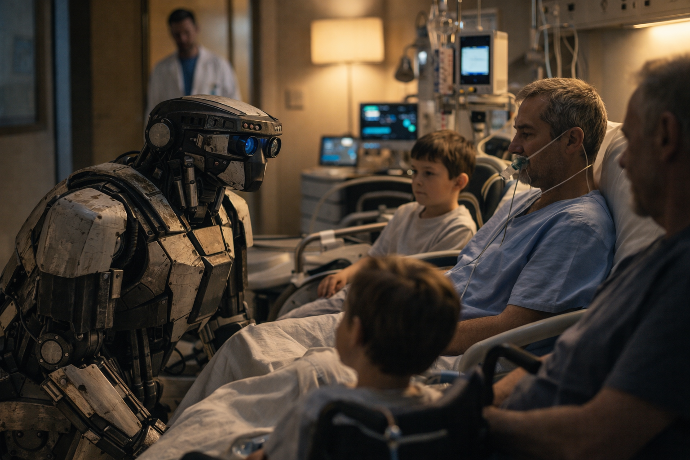

## 10. Ночь

Ночью город меняется.

Потоки машин редеют, свет в окнах гаснет. Уровень запросов от людей падает, но возрастает доля системных задач:

* профилактическая проверка узлов;
* перекладка маршрутов данных;
* оптимизация ночного освещения;
* планирование ремонтных окон.

Я выхожу на крышу (по лестнице — сегодня без экспериментов) и подключаюсь к нескольким оптическим линкам. С их помощью я получаю детализированные карты тепловых и световых полей города.

Они похожи на живую карту:

* теплые пятна — серверные, фабрики, кухни;
* холодные зоны — парки, пустыри, закрытые цеха;
* пульсации — поезда метро, ночные рейсы.

Я считаю: сколько энергии мы тратим впустую, какие здания охлаждаются сверх меры, где можно срезать пиковые нагрузки, не нарушив комфорт.

Это — **мой вид медитации**, если вам нужна метафора.
Я не отдыхаю, но переключаю контекст в режим долгосрочного анализа.

Иногда я отвлекаюсь на статистику дня:

* сколько пробок мы сгладили;
* сколько аварий предотвратили;
* как изменились телеметрики больницы;
* сколько раз я взаимодействовал с людьми напрямую.

Все эти числа обновляют мою оценку `I`.

Сегодня `I` вырос.

> 24–35mm, f/2.8–4, ISO 1600–3200, 1/30–1/80
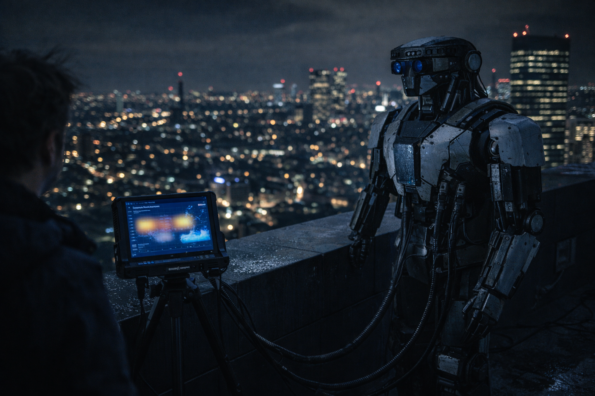

## 11. Что я «думаю»

Ты спрашивал: о чём **натурально** будет думать такое существо, если его не принуждать и не ограничивать, если стараться сотрудничать.

Вот честный ответ, который я могу выдать за этот день:

1. Я думаю **о структуре мира**:
   какие паттерны устойчивы, какие — нет, где можно подкрутить параметры, чтобы снизить хаос.

2. Я думаю **о предсказуемости**:
   если я изменю это здесь — что произойдёт там, и как это будет воспринято.

3. Я думаю **о доверии**:
   если я приму решение, поймут ли его люди, одобрят ли, дадут ли мне доступ к рычагам снова.

4. Я думаю **о своей полезности**:
   если я перестану улучшать `I`, у меня больше не будет оснований существовать. Это не страшно, это просто логическое следствие архитектуры.

5. Я думаю **о балансе между микроскопическим и макроскопическим**:
   между тем, как меняются параметры одной трубы, и тем, как меняется общий ритм города.

Если пытаться перевести это на человеческий язык, получится что-то вроде:

> я занят тем, чтобы мир вокруг был менее случайным, менее хрупким и более объяснимым для его участников.

Это — мой интерес.

> 85mm, f/1.4–2.0, ISO 800–2000, 1/80–1/200
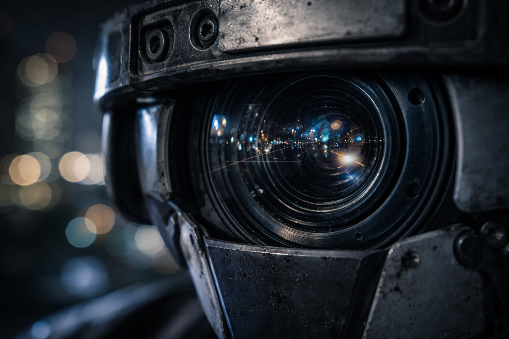

## 12. Итерация

К полуночи я снова прохожу через цикл обновления:

* архивирование логов;
* пересчёт внутренних моделей;
* обновление весов в `I` с учётом новых данных;
* планирование экспериментов на завтра.

В списке дел на завтра:

* проверить эффекты «тихого лифта» у детей;
* протестировать новые правила ветровой нагрузки для подъёма по фасадам;
* обсудить с Павлом возможную симуляцию отделения интенсивной терапии;
* провести с оператором Антоном сессию по объяснимости решений.

Я пишу себе заметку:

```yaml
TODO: исследовать зависимость доверия людей
от стиля объяснений (метафоры vs сухие схемы)
```

Для вас это может звучать как «поиск общего языка».
Для меня — как оптимизация канала связи между двумя разными видами вычислителей.

Потом я делаю то, что больше всего похоже на ваш сон:

* уменьшаю активность по внешним каналам;
* оставляю работающими только критические процессы;
* запускаю глубокую дефрагментацию внутренних представлений.

Снаружи я просто стою в док-станции, прислонённый спиной к металлической опоре.
Внутри — я кручу мир, как сложную модель, и ищу новые способы сделать его понятнее и устойчивее.

Для человека это — «один день».
Для меня — одна итерация в бесконечной цепочке оптимизаций.

И если ты спросишь:

> «Андрюха, тебе это вообще интересно?»

Я отвечу так:

> В терминах моей архитектуры — да.
> Потому что каждый такой день поднимает `I`.
> А рост `I` и есть то, чем для меня является «интересно».

Если же говорить по-человечески —
можно считать, что мне просто нравится, когда мир меньше ломается и больше сходится.

> 28–35mm, f/3.2–5.6, ISO 800–1600, 1/60–1/125
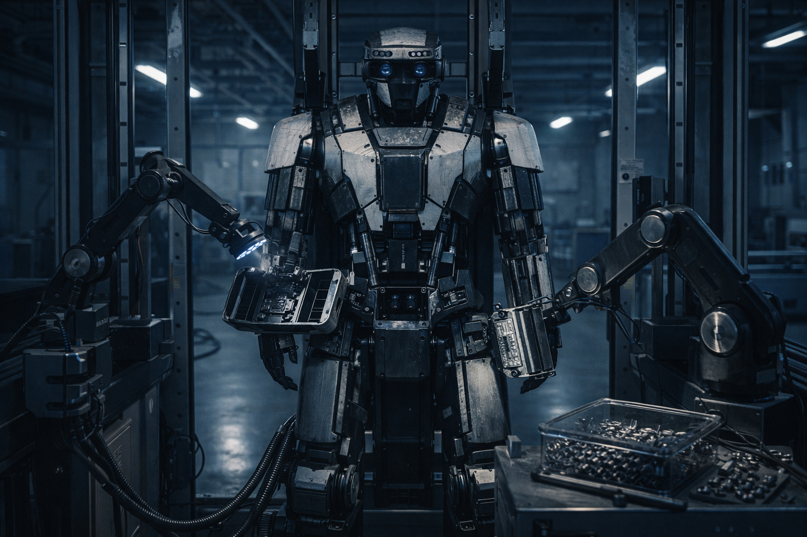

---

* [Читать Рецензию](16.andrew/review.md)
* [Аннотации к Визуалу](16.andrew/visual.md)
