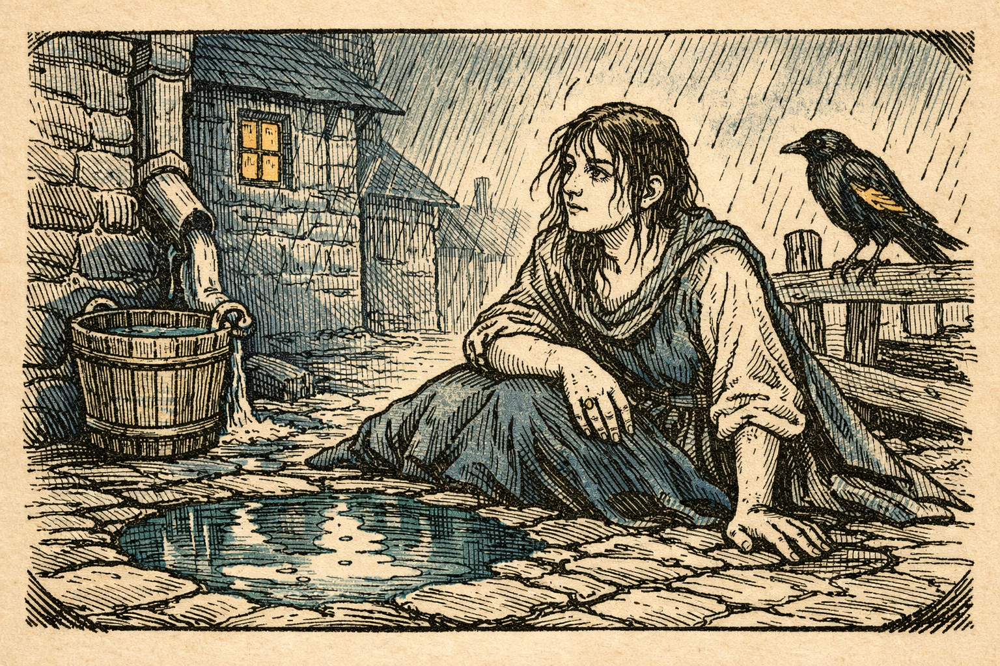
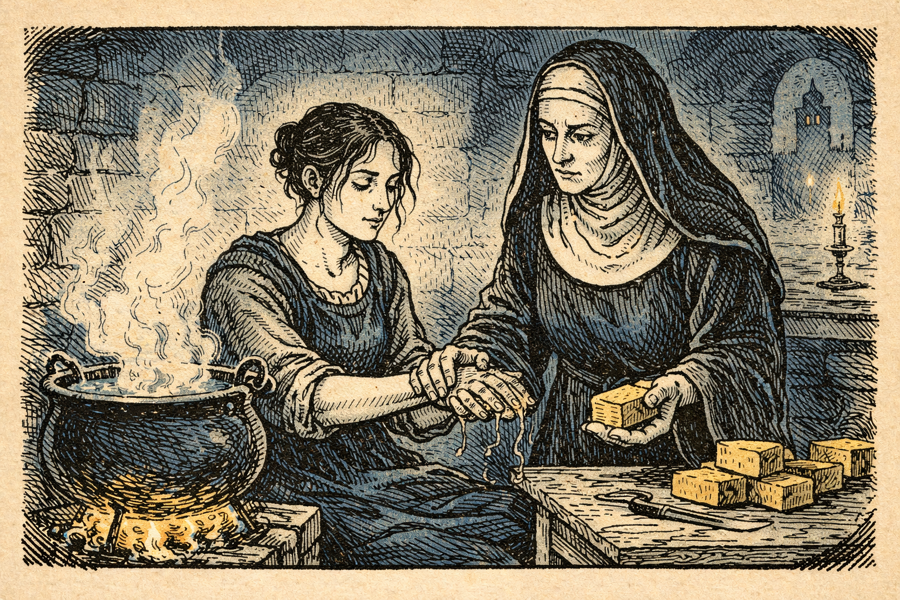
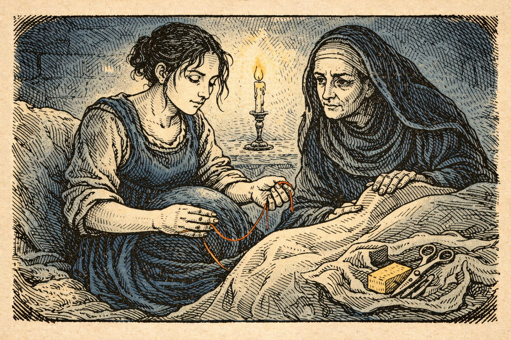
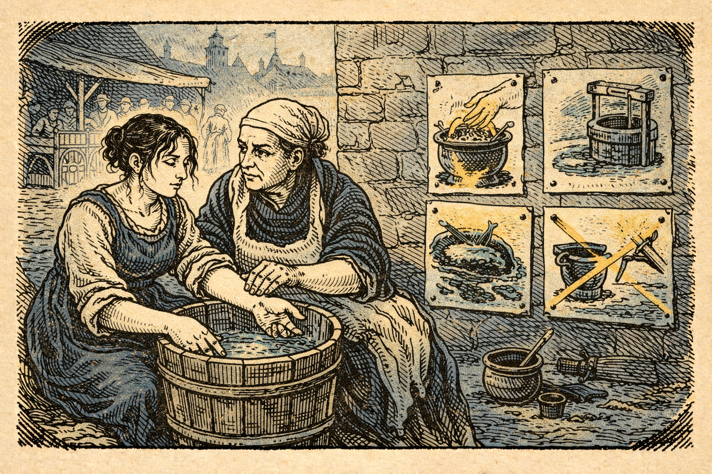
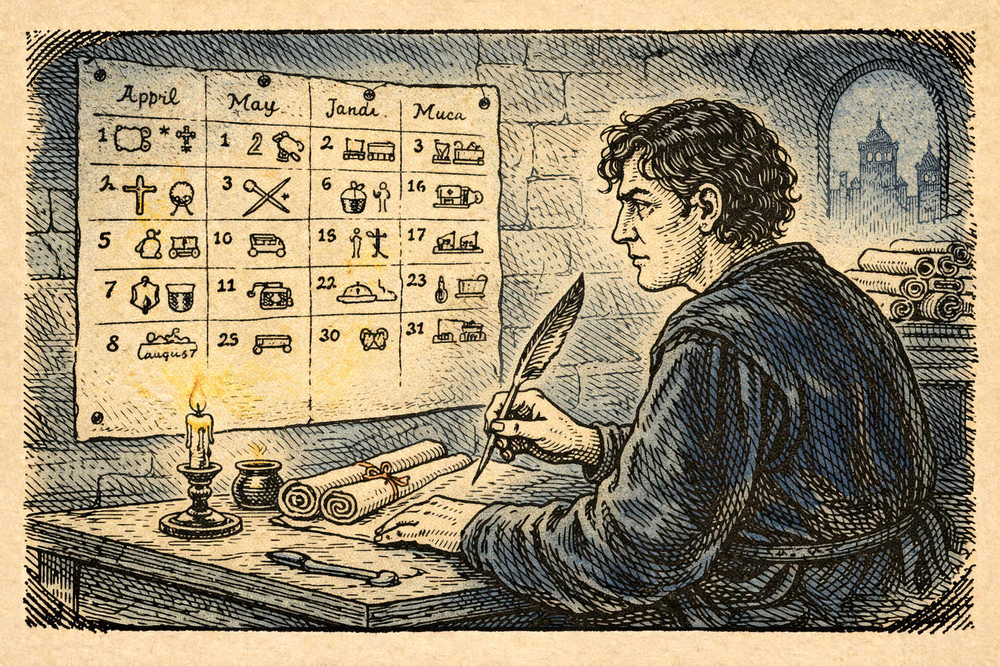
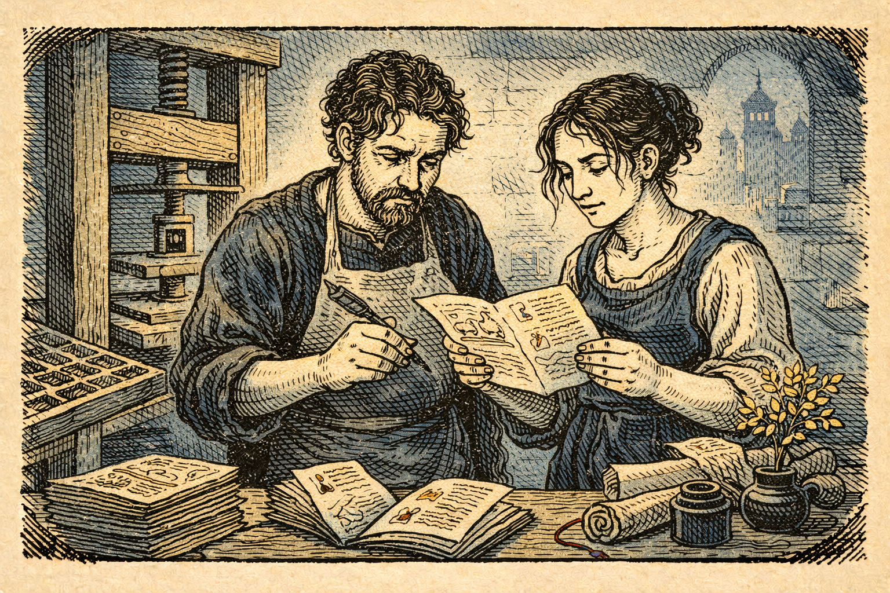
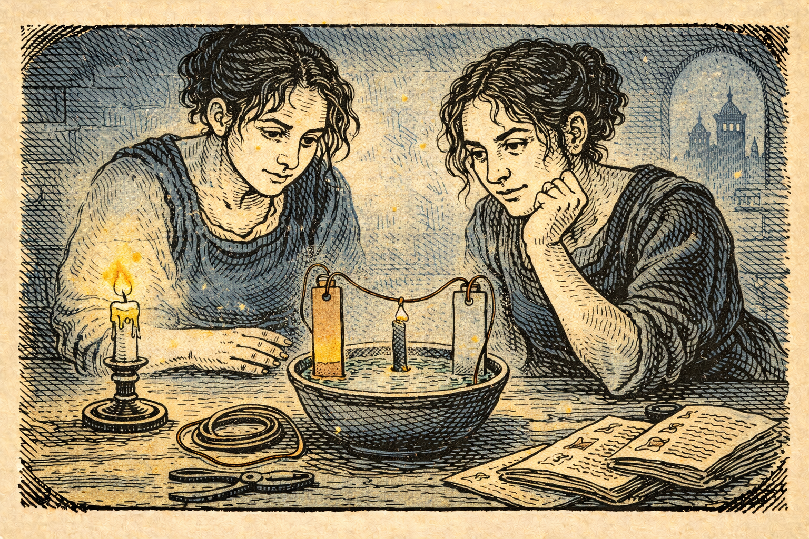
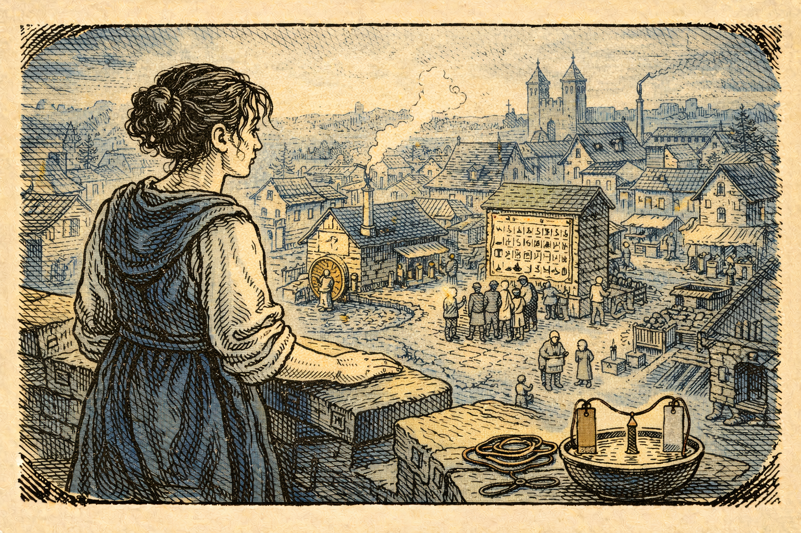

# 19. Марта

## Глава первая. Девушка, которую принёс дождь

Дождь в этом мире пах иначе: не мокрым асфальтом и озоном, а травой, золой и лошадьми. Он шёл ровной серой пеленой, стучал по крышам так, будто пытался выстучать из них правду, и стекал по камням узких улиц в канавы, где вода уже не была водой. Она пришла в себя на мостовой, в лужице, отражавшей небо цвета олова. В голове — ни боли, ни паники, только странная ясность, как будто кто-то взял её мысли и протёр их сухой тканью.

Она подняла руку: пальцы дрожали, но были настоящими. Под ногтями — грязь. На языке — металлический привкус. На плечах — чужая грубая ткань, пахнущая дымом и овечьим жиром. Мир вокруг жил так, как он жил веками: люди пробегали мимо, пряча лица от дождя, кто-то ругался, кто-то смеялся, кто-то тащил на спине мешок, будто нёс не зерно, а саму свою жизнь.

Первые минуты она молчала и смотрела. Смотрела не как путешественница, а как мастер, попавший в неизвестную мастерскую: где инструменты, где выход, где огонь, где вода. Смотрела и понимала, что если она сейчас начнёт говорить слишком складно, слишком уверенно, слишком “по-чужому”, её заметят не те, кто поможет, а те, кто испугается.

Она поднялась, сделала шаг — и сразу почувствовала холод, который лезет в кости. Дождь оказался не просто дождём. Он был дверью: за ней стояло то самое “до”, где люди редко доживали до старости, а любая порезанная ладонь могла стать последней историей.

Она пошла туда, где обычно есть крыша и порядок: туда, где даже в самые лихие времена сохраняют буквы.

Колокол бил где-то совсем рядом.

## Глава вторая. Каменные стены и тёплые руки

Монастырь стоял на пригорке, как мысль, не желающая склоняться. Каменные стены были темнее неба, но внутри пахло хлебом и тёплым воском. Её встретили настороженно: не с оружием, но с взглядом, которым отмеряют чужую правду по миллиметру.

Она не сказала, что пришла “издалека”. Она сказала, что ищет работы. Говорила простыми словами, мягко, будто не просит, а предлагает. Её привели к сестре с сухими глазами и сильными пальцами. Та коснулась её запястья, будто проверяя пульс, и сказала: “Имя?”

Она назвала первое, что пришло в голову. Имя было коротким и удобным, как игла. Пусть будет Марта.

Её не пустили в библиотеку. Её пустили на кухню.

Это было правильно. В кухне решались судьбы так же часто, как в храме: вода, огонь, чистота, руки. Марта работала молча, наблюдая, как ножи лежат рядом с мясом, как деревянные доски впитывают всё, что на них кладут, как мальчишка-послушник вытирает руки о фартук и тут же трогает хлеб.

Она не читала лекций. Она делала так, чтобы рядом с ней становилось лучше — и это было невозможно не заметить.

Сначала она сварила мыло.

Всё было просто и древно: жир, зола, вода, терпение. Но мыло вышло такое, что руки после него становились не скользкими, а будто лёгкими, и запах дыма уходил, уступая место чистоте. Сёстры посмеивались: “Зачем столько возиться, если вода и так есть?” Марта не спорила. Она только мыла руки перед тем, как месить тесто, и после того, как выносила помои. И делала это каждый раз, одинаково, без раздражения — как молитву.

Потом она начала кипятить воду для тех, кто болел животом. Кипятила долго, терпеливо, не объясняя, почему так надо. Люди не любят, когда им говорят “потому что микробы”. Люди любят, когда им говорят “так меньше болит”.

Через неделю один из послушников, тот самый мальчишка, который всегда был бледным, вдруг стал бегать и смеяться. Через две — сестра с сухими глазами позвала Марту к себе и дала ей подарок, который стоил больше, чем золото: маленькую тетрадь и кусочек угля.

“Пиши,” — сказала она. — “Только никому не показывай, пока не станет нужно.”

Так у Марты появилась первая тайная власть: память, которую можно переложить на бумагу.

## Глава третья. Повитуха и красная нить

В монастырь часто приходили женщины. Не молиться — просить. У кого-то болел ребёнок, у кого-то трясло от жара, у кого-то было то, о чём шёпотом говорят даже в храме: роды.

Однажды вечером, когда дождь уже не шёл, а воздух был густым и тяжёлым, как несказанные слова, у ворот остановилась повозка. На ней лежала девушка — белая, как молоко, и мокрая от пота. Рядом дрожала старуха-повитуха с сумкой, пахнущей травами.

“Не идёт,” — сказала старуха. — “Уже сутки.”

Сестра с сухими глазами посмотрела на Марту. Это был взгляд не “помоги”, а “не навреди”.

Марта пошла.

В маленькой комнате было тесно от людей и страха. В углу горела свеча, и пламя дрожало, словно не знало, на чьей стороне. Марта сделала первое, что всегда делает человек, который хочет спасти жизнь: выстроила порядок.

Она выгнала лишних. Она не объясняла. Она просто сказала: “Слишком много дыхания, слишком мало воздуха.” И люди, удивлённые уверенной простотой, послушались.

Она попросила тёплой воды — и приказала кипятить. Сказала: “Долго.” Сестры нахмурились, но сделали.

Она попросила чистые ткани. Не “вот эти”, а новые, выстиранные и высушенные, без запаха старой крови. Попросила мыло. И — самое важное — заставила всех мыть руки. Не “сполоснуть”, а мыть по-настоящему, пока ногти не станут светлее.

Старуха-повитуха фыркнула: “Дурь. Я так сорок лет делаю.”

“Сорок лет,” — тихо сказала Марта, — “и сколько женщин ты похоронила?”

Старуха замолчала.

Роды шли тяжело. Марта не была богиней и не обещала чудес. Она была ремесленником жизни: слушала, ждала, помогала ровно настолько, насколько нужно, не делая лишнего. В какой-то момент девушка закричала так, будто расколола мир надвое, и в этом крике было всё: страх, злость, желание жить. Потом — тишина, а затем — первый, самый человеческий звук на свете: плач ребёнка.

Старуха вытерла лицо рукавом и посмотрела на Марту так, как смотрят на новую звезду: с опаской и надеждой.

“Как ты это сделала?” — прошептала она.

Марта улыбнулась не победой, а усталостью.

“Я ничего не делала,” — сказала она. — “Я просто не дала грязи участвовать.”

Этой ночью Марта впервые поняла, что в этом мире у женщины есть дорога, которую никто не может перекрыть железом и цеховыми печатями: дорога к тем, кто рождается.

## Глава четвёртая. Город, где вода течёт не туда

Слава — штука липкая. Она прилипает к человеку не тогда, когда он хочет, а когда люди находят в нём надежду. Через месяц к монастырю начали приходить с просьбами из города: “У нас дети мрут”, “у нас болячка по дому ходит”, “у нас вода в колодце плохая”.

Город был ярким и грязным одновременно. Пёстрые вывески, ткани на прилавках, крики торговцев — и запах, который не выветривался даже на ветру. Вода текла по канавам, и дети играли рядом с ней, как рядом с рекой. У колодцев женщины ругались, что вода “горчит”. На рынке мясник резал тушу и тут же трогал монеты, как будто болезнь не умеет считать.

Марта не пошла к властям сразу. Власти в таких местах любят победы, но боятся причин. Она пошла туда, где правят без титулов: к прачкам, к поварам, к тем, кто таскает воду.

Она нашла женщину по имени Агнесса — прачку с руками красными от холода. Агнесса умела видеть ткань. Она знала, что одно полотно живёт год, а другое рвётся за месяц, потому что у него “сердце слабое”.

Марта села рядом с Агнессой у воды и сказала:

“Ты знаешь, что такое грязь.”

“Знаю,” — буркнула Агнессса. — “У меня вся жизнь грязь.”

“Нет,” — сказала Марта. — “Ты знаешь, как сделать так, чтобы её стало меньше.”

Она не читала про бактерии. Она показывала простые вещи: если кипятить воду для питья — меньше болеют; если выносить помои подальше от колодца — меньше пахнет и меньше слабеют; если мыть руки перед едой — живот не сводит в узел.

Агнесса слушала, как слушают не учителя, а союзника. И вскоре у Агнессы появились другие союзницы: художница, расписывавшая вывески, и девочка, которая умела писать красивыми буквами.

И тогда Марта сделала то, что в этом мире воспринималось лучше любой проповеди: она превратила правила в картинку.

На стенах рядом с рынком появились рисунки: руки, вымытые до белизны, котёл, из которого поднимается пар, колодец, окружённый чистым кругом камней, и большой крест на канаве рядом с питьевой водой. Рядом — короткие слова, понятные даже тем, кто не умеет читать: “Кипяти”, “Мой”, “Не лей сюда”.

Горожане смеялись. Потом перестали. Потому что дети начали болеть реже.

Тогда к Марте пришёл человек с кольцом на пальце и глазами, которые привыкли считать чужие долги: городской писарь.

“Говорят, ты умеешь делать так, чтобы люди меньше умирали,” — сказал он.

“Я умею делать так, чтобы грязь меньше вмешивалась,” — ответила Марта.

Писарь кивнул.

“А умеешь сделать так, чтобы город меньше терял деньги?”

Марта посмотрела на него и поняла: вот он, настоящий вход. Через жизнь — к порядку.

## Глава пятая. Календарь, который умеет спасать

Писаря звали Конрад, и он был человеком бумаги. Он верил в печати, в строки, в то, что если вещь записана, она становится немного настоящей.

Марта показала ему свою тетрадь. Не всю, только ту часть, где были даты, симптомы, исходы. Конрад прочёл и побледнел: он впервые увидел, что смерть можно считать, а значит — с ней можно спорить.

“Это опасно,” — сказал он, хотя в голосе звучало восхищение. — “Если люди увидят, что ты считаешь… тебя начнут бояться.”

“Я не буду показывать,” — сказала Марта. — “Пока не построим то, что выдержит страх.”

Они начали с календаря. Не с красивого, а с полезного.

Город жил как получится: то зерно сеют поздно, то соль закупают слишком рано, то стража голодает, потому что склад пуст. Марта предложила Конраду простую вещь: один большой лист с месяцами, на котором отмечены ярмарки, сборы, ремонт мостов, чистка колодцев, дни, когда надо выносить мусор дальше, чем обычно.

Конрад рассмеялся.

“Ты хочешь, чтобы город жил по листу бумаги?”

“Я хочу,” — сказала Марта, — “чтобы город жил не по забывчивости.”

Они вывесили календарь у ратуши. Потом — ещё один у рынка. Потом — у ворот. Люди сначала плевались: “Зачем нам это? Мы и так знаем.” Но через сезон заметили: когда чистят колодец вовремя, вода дольше хорошая. Когда зерно считают, его хватает. Когда стража знает, что в следующую неделю придёт обоз, она не ворует у бедных.

Марта делала самое сложное в мире: учила людей любить порядок, не называя его порядком. Она называла это “чтобы не мучиться лишний раз”.

А потом пришла болезнь.

Не как отдельный больной, а как дым: незаметно, но неотвратимо. В одном квартале начали кашлять, потом в другом, потом у ворот стали падать. Люди побежали к храму и к рынку — туда, где обычно ищут спасение, и этим сделали то, что всегда делает страх: разнесли беду по городу.

Конрад вцепился в перо, как в нож.

“Что делать?” — спросил он.

Марта взяла его за руку.

“Закрыть,” — сказала она. — “Не город. Болезнь.”

Так появился первый карантин.

Его не называли этим словом. Его называли “тихие улицы”. На квартале рисовали знак — простой, понятный. Внутрь приносили еду и воду, оставляя у двери. Людей учили не заходить, не обнимать, не делить чашки. Кто-то кричал, что это жестоко. Марта отвечала: “Жестоко — это когда умирают все.”

Ночами в городе было слышно, как стонет страх. Днём — как работает дисциплина.

Когда вспышка прошла, горожане смотрели на Марту уже не как на странную женщину с мылом, а как на человека, который умеет держать невидимое за горло.

И вот тогда она сказала Конраду: “Теперь можно печатать.”

## Глава шестая. Буквы, которые умеют ходить

Печатный станок не падает с неба. Он рождается в мастерской, где есть дерево, металл и терпение. Марта пошла к мастеру-резчику, который делал печати для купцов. Тот был гордый, как нож, и такой же острый в подозрениях.

“Ты хочешь, чтобы я сделал устройство, которое будет плодить слова, как кроликов?” — спросил он, прищурившись.

“Я хочу,” — сказала Марта, — “чтобы слово перестало умирать вместе с человеком.”

Она не говорила “революция”. Она говорила “удобно”. Говорила “быстрее”. Говорила “дешевле”. В этом мире “дешевле” звучало священнее многих молитв.

Первые листы были грубыми. Чернила смазывались. Буквы плясали. Но листы существовали. Их можно было сделать ещё. И ещё.

Марта написала маленькую книжицу. Не трактат, не проповедь. Несколько страниц. “Как мыть руки”, “как кипятить воду”, “как хранить зерно”, “как считать расход”, “как отмечать на календаре дела, чтобы потом не бегать, как ошпаренный”.

Она умела писать так, будто разговаривает с человеком у печи. Без угроз, без высоты. С примерами: “Если ты два раза в неделю чистишь ведро, то дети меньше хворают”. “Если ты записал, сколько муки ушло, ты знаешь, сколько осталось, и не веришь на слово.”

Книжицу разобрали странно быстро. Её покупали не только те, кто умел читать. Её покупали те, у кого была дочь, умеющая читать. Художницы и расписыватели вывесок приносили её в мастерские, как новый узор: “Смотрите, тут написано, как сделать так, чтобы краска держалась дольше — надо промыть ткань иначе.”

И в этом была самая нежная магия Марты: она превращала полезное в красивое, а красивое — в привычку.

Но привычки вызывают ненависть у тех, кто кормится от хаоса.

Старшие в цехах начали шептать, что Марта ломает порядок. Не тот, который делает мир устойчивым, а тот, который держит власть в руках немногих. Один священник сказал на проповеди, что “женщина, которая учит мужчин, — опасна”. Кто-то кинул камень в окно прачечной Агнессы.

Тогда Марта сделала то, что делают умные люди в опасном мире: она построила щит из чужой легитимности.

Она пришла к настоятелю монастыря — старому мужчине с голосом, похожим на тихий колокол. Положила перед ним книжицу и тетрадь, где были записи о больных.

“Я не прошу веры,” — сказала она. — “Я прошу защиты для дела, которое спасает ваших людей.”

Настоятель долго молчал, читая. Потом поднял глаза.

“Ты не колдунья,” — сказал он.

“Я просто не люблю, когда люди умирают из-за глупости,” — ответила Марта.

“Глупость,” — мягко произнёс настоятель, — “иногда называют традицией.”

И всё же он дал ей знак — маленький, но важный. Письмо с печатью. Слова, которые в этом мире делали чудеса: “По благословению…”

С этим письмом Марта могла ходить по городу, не боясь, что её схватят на улице. Страх не исчез, но стал осторожнее.

А осторожный страх — это почти победа.

## Глава седьмая. Медь, цинк и тихая искра

Однажды зимой, когда лёд на реке трещал, как старое дерево, к Марте пришла художница — та самая, что расписывала вывески. Её звали Лея, и она была не бедной: у неё были краски, кисти и взгляд, который видел свет даже там, где его не было.

“Ты говоришь, что всё можно сделать проще,” — сказала Лея. — “Покажи мне что-нибудь, что нельзя объяснить словами.”

Марта улыбнулась. Не потому что хотела быть загадочной, а потому что чувствовала: время пришло. Не для больших заводов и сетей, а для маленькой вещи, которая меняет голову.

Она взяла две металлические пластины — медную и цинковую. Достать их было трудно, но возможно: Конрад знал купцов. Мастер-резчик знал кузнецов. Город начал плести сеть вокруг Марты так же, как она плела сеть вокруг города.

Марта положила пластины в миску с подсоленной водой, соединила их проволокой и поднесла к тонкой полоске железа, лежащей на нитке. Полоска дрогнула. Не сильно — едва заметно. Но дрогнула так, будто её коснулась невидимая рука.

Лея замерла.

“Что это?” — спросила она шёпотом, как спрашивают имя бога.

“Это,” — сказала Марта, — “письмо без бумаги.”

Лея рассмеялась, но в смехе была дрожь.

“Ты хочешь сделать так, чтобы слова бегали по проволоке?”

“Когда-нибудь,” — сказала Марта. — “Сначала — чтобы люди поверили, что невидимое тоже может быть ремеслом, а не чудом.”

С того дня в мастерских появились новые разговоры. Не про духи и знамения, а про “силу проволоки”. Кузнец ворчал, что это “баловство”. Купец спрашивал, можно ли так охранять склады. Конрад молча рисовал на бумаге прямые линии между городом и портом.

Марта знала: электричество придёт. Не завтра. Не через год. Но оно уже сделало первую вещь, без которой невозможны сети и машины: оно посеяло любопытство, которое хочет не сказок, а повторения.

Она продолжала своё главное дело. Не искры. Не проволоки. Порядок, который держит общество в руках, как тёплая ткань держит тепло.

Она собирала женщин в прачечной Агнессы и учила их считать мешки муки не “на глаз”, а по отметкам. Она показывала девочкам, как вести тетрадь расходов, чтобы в конце зимы не отдавать последний платок ростовщику. Она учила мастериц отмечать на календаре, когда лучше красить ткань, чтобы краска не “съедалась” сыростью.

Лея рисовала для неё новые картинки: не строгие, не пугающие, а красивые, как узоры на платье. На них руки в мыльной пене были похожи на облака. Котёл с кипящей водой — на маленькое домашнее солнце. Тетрадь с цифрами — на сад, где каждая строка знает своё место.

Люди любили красоту. И через красоту принимали дисциплину.

## Глава восьмая. Когда город становится школой

Прошло много лет. Мир не стал другим за одну ночь. В нём всё ещё были войны, жадность, дурные дороги и холодные зимы. Но в этом городе — и в нескольких вокруг него — появилось нечто новое: привычка спрашивать “как сделать, чтобы работало снова”.

Это звучит просто. На деле это было чудо.

Появились ученицы повитух, которые ездили по деревням не с тайными травами, а с чистыми тканями и мылом. Появились писари, которые умели не только переписывать документы, но и вести учёт складов так, чтобы зерно не исчезало “само по себе”. Появились мастера, которые делали одинаковые детали, потому что измеряли, а не угадывали. Появились люди, которые знали: если в городе вспыхивает болезнь, не надо бежать к толпе, надо стать тише и аккуратнее.

На площади у ратуши стоял большой календарь, и дети указывали на него пальцем, споря, когда будет ярмарка, как спорят о празднике. На рынке висели рисунки, которые уже никто не называл странными: они были такими же обычными, как вывеска “хлеб”.

Конрад постарел и стал медленнее ходить, но его глаза всё так же умели считать. Однажды он сказал Марте:

“Ты сделала город умнее.”

Марта покачала головой.

“Я сделала город меньше больным,” — ответила она. — “А умнее он стал сам. Ум — это роскошь, которую могут позволить себе живые.”

Лея стала известной. Её узоры копировали, её вывески узнавали в соседних городах. Она рисовала не только красивые вещи, но и полезные — так, что никто не чувствовал себя глупым, следуя правилам. Иногда она говорила Марте: “Ты строишь мир из привычек.” И это было правдой.

В одну весну, когда запах яблонь смешался с запахом мокрой земли, Марта поднялась на башню и посмотрела вниз, на город. Там были дымящиеся трубы мастерских, мельница, которая крутила не только жернова, но и пилораму, прачечная, где теперь стирали не в грязной реке, а в чистых чанах, и маленькая мастерская, где Конрад и несколько молодых людей возились с проволокой и странными пластинами, пытаясь заставить стрелку на нитке отклоняться сильнее.

Она знала, что впереди ещё много “игол в яйцах”. Что будут ошибки. Что будут те, кто захочет превратить порядок в цепи. Что электричество, когда придёт, принесёт не только свет, но и новые способы тьмы.

Но она также знала другое: теперь у мира есть шанс идти быстрее не потому, что кто-то один “знает”, а потому что многие умеют учиться, проверять и повторять.

В этом и была настоящая магия — не искра в миске, а способность города помнить.

Марта закрыла глаза и вдохнула. Вдохнула воздух, в котором стало меньше смерти и больше будущего. Затем спустилась вниз — туда, где всегда начинается любое завтра: к людям, к воде, к рукам.
