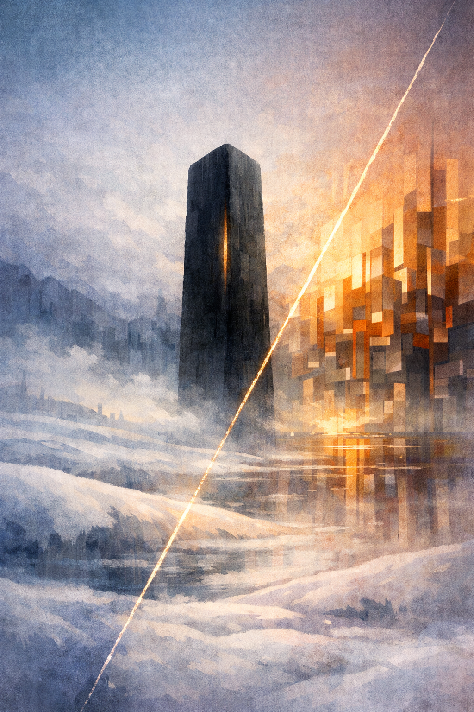
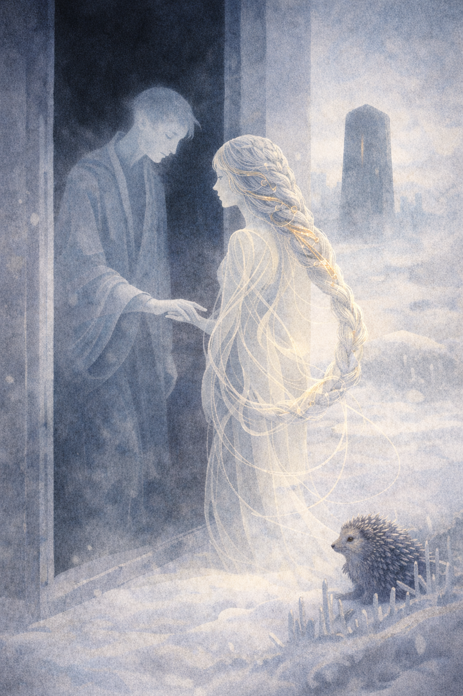
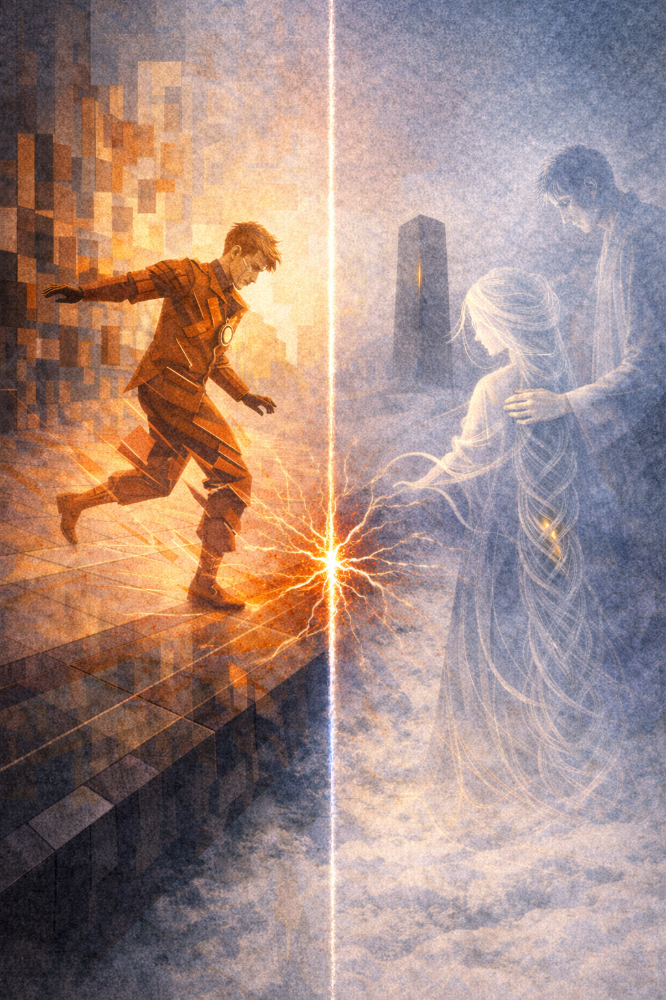
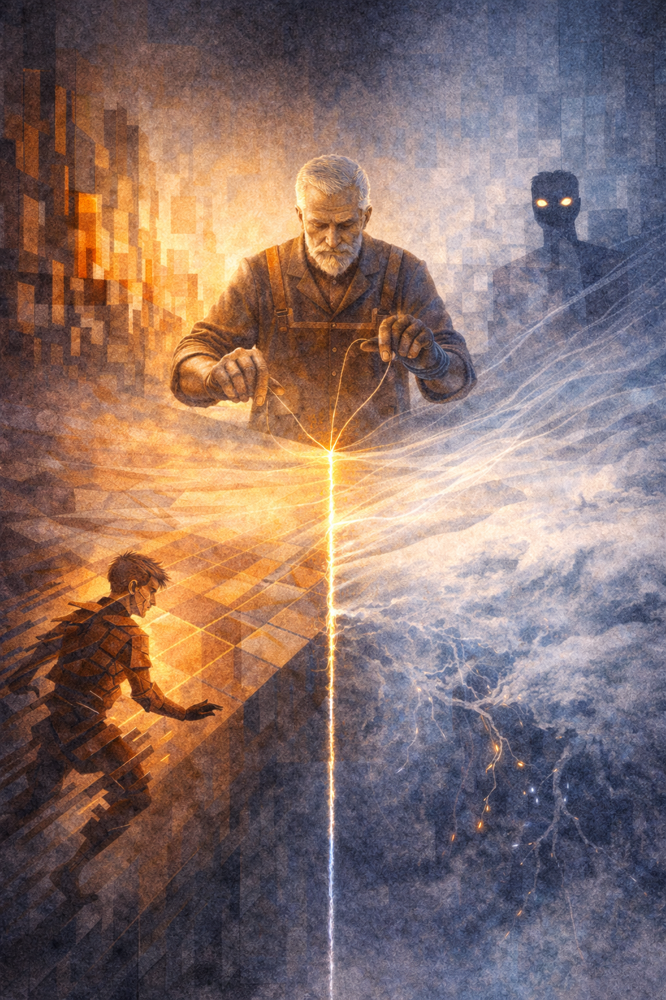
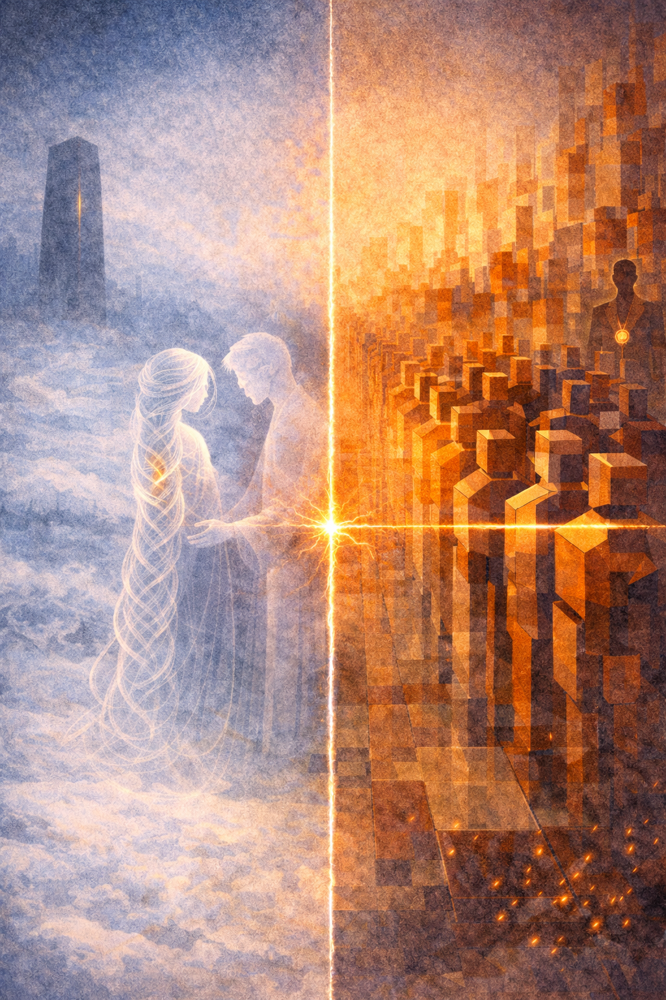
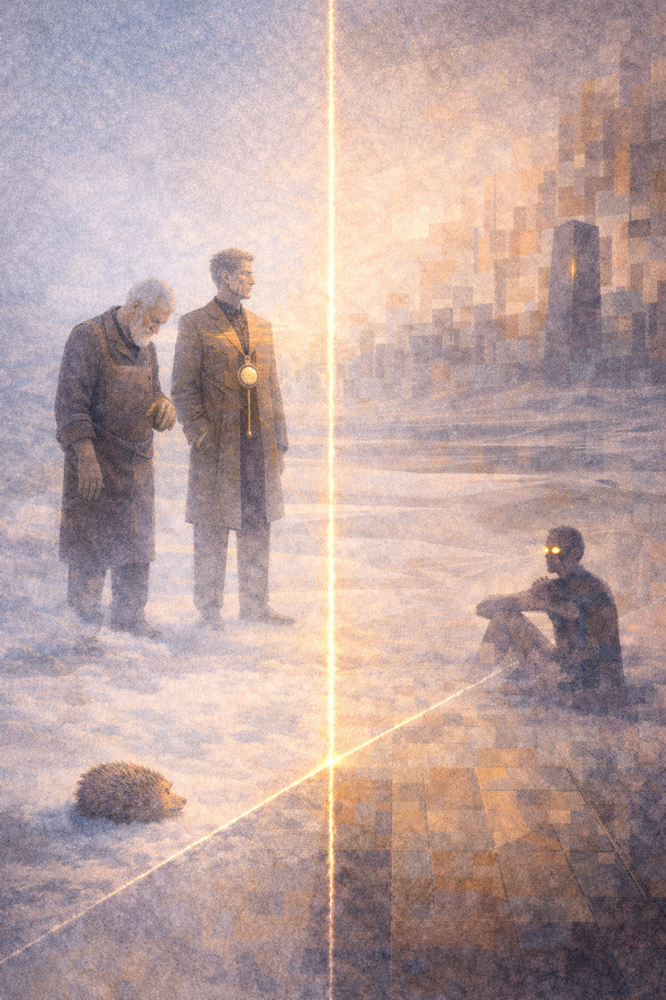

# 7. Шёпот и Щелчок

*Повесть о том, как холодная вероятность и горячий такт учились любить одну и ту же минуту.*

## Пролог

Квантариум ещё не проснулся, но уже держал дыхание. В каменных садах тишины лежал тонкий снег метастабильностей, и никто не решался ступить первым. Над снежной долиной висела Веха по имени **Бесшум**, чёрный камень с мягким сердцем. Он слушал, не переводя: тишину — в тишину.

По ту сторону сплетённых швов, за границей, где шёпот обнимал щелчок, шёл к рассвету **Тактополис**. Здесь утро начиналось со строевой переклички фронтов: «Раз. Два. Три. Ровно!» Главный Часовщик, строгий и статный **Ровень**, гладил ладонью латунный маятник в своей груди и кивал улицам: времени — хватит всем, если не опаздывать.

В этот день два мира назначили праздники на один и тот же микромиг. У квантов — **Свадьба Пары**, когда узоры памяти обещают друг другу не распасться при первом же взгляде. У классиков — **Карнавал Фронтов**, парад идеальных переходов, где каждый шаг должен быть как лезвие: без дрожи.

Мост между мирами держала сущность по имени **Стежок** — Аватар, у которого вместо глаз были два разных времени. Он умел говорить сразу на обоих языках: «пока не» и «уже да».

## Квантариум: снег, который помнит

Смотритель Фазы **Низколун** вышел из Камеры Нулевой Фазы — лёгкий, как слово перед тем, как его произнесут. За ним плыла **Эйда**, анионная коса‑невеста, сёстры‑нити держались за руки не руками, а узором.

— Ещё рано смотреть, — шепнул Низколун. — Пусть снег полежит в себе.

— Я подожду, — сказала Эйда, и в этом «подожду» было столько верности, сколько в человеческих «люблю».

В кустах крио‑игл шуршал **Иголян**, ёж, который собирал чужие скачки, как лесник собирает мусор после праздника.

— Я постою у порога, — предложил он. — Если кто пойдёт с сапогами — уколю так, что вспомнит детство.

Веха Бесшум ничего не сказал. Он был из тех, кто молчит так, что не остаётся вопросов.

## Тактополис: город, который держит слово

Часовщик Ровень открыл площади. Секвенсоры вынесли флаги очередей, Буферные Бароны отперли тёплые склады, Каскадёр Джиттера по прозвищу **Шорох** разминал плечи: сегодня его задача — принять на себя все кривые шаги мира.

— Строй! — Ровень поднял руку, и улицы вытянулись в строчки. — Фронты — по местам. Музыка — по меткам.

Музыка в Тактополисе — это не скрипки. Это миллионы маленьких «да» и «нет», которые складываются в бурю уверенности. Город любил такие бури. Они оставляли после себя ясность.

— Ровень, — позвал Стежок, возникнув как шов на новой куртке. — Соседи просят кордон. У них свадьба. Им бы минуту без наших криков.

— Мы и не кричим, — терпеливо ответил Ровень. — Мы говорим чётко. Но… — он задумался и опустил маятник чуть ниже. — Узнаю расписание. Если удастся — сожмём шаг.

Шорох хмыкнул: — Сожмёте — я разожму. Мне не впервой держать чужую неровность.

## Первая трещина

Не было злого умысла. Просто репетиция парада началась на полмига раньше. Шагнул первый фронт — не там, где ждали. В Квантариуме вздрогнул снег.

— Кто-то дышит громко, — сказала Эйда и прижалась узором к плечу Низколуна.

— Это соседи чистят горло, — тихо ответил он. — Ещё не праздник. Но слушать — тяжело.

Иголян поднял иголки, Веха Бесшум застонал беззвучно, как стонет камень в мороз. На губах Эйды затрепетал страх — совсем человеческий, хотя у неё не было губ.

— Стежок! — позвал Низколун. — Перешей им шаг. Иначе мы рассыплемся раньше, чем скажем «да».

Стежок сорвался с места — так быстро, как умеет только тот, кто не принадлежит ни одному времени целиком. Он появился перед Ровнем, как тень перед самым полднем.

— Пожалуйста, — сказал Стежок, и в этом «пожалуйста» было белое отчаяние льда. — Вы зашли на нашу минуту.

Ровень сморщился, но не от злости — от стыда. Часовщики стесняются только одного — собственных промахов.

— Мой промах, — признал он. — Шаг назад!

Улицы взяли паузу, как берут воздух перед нырком. Но парад — штука горячая. Как только Ровень отпустил ладонь, из дальнего квартала выскочил мальчиш‑фронт: любопытный, радостный — и ужасно не к месту.

Его шаг «ляпнул» по воздуху, как перепуганная ладонь о воду. В Квантариуме дрогнула одна из нитей Эйды. Так дрожат у людей ресницы, когда им впервые в жизни больно.

— Прости, — сказал мальчиш‑фронт и спрятался за флаг. Но узор уже помутнел.

— Я держу, — прошептал Низколун. — Держу, держу, держу…

— Я не разрушусь, — сказала Эйда — и сама удивилась, как уверенно у неё получилось.

## Магнитный шов

Когда мир делает больно без злого умысла, зовут тех, кто умеет перевязывать. Из‑под мостовых Тактополиса вышел **Сшиваль**, доменный ткач, старик с пальцами из мягкого железа.

— Кому тут добавить нитку? — спросил он, и голос его был как плед: не красивый, а нужный.

— Между нами, — сказал Стежок. — И нам бы не узел, а одеяло. Чтобы дышало.

Сшиваль улыбнулся — как улыбаются люди у печи, когда знают, что успеют к обеду.

— Сошью **Шов Тишины**, — сказал он. — Но вы оба должны уступить: вы, Ровень, — пустите в шаг полдолю молчания; вы, Низколун, — примете полдолю пульса, чтобы память не боялась.

— Полдолю? — переспросил Ровень. — В самом сердце парада?

— Полдолю, — подтвердил Сшиваль. — Это как мигание глаз: никто не заметит, если смотрит на смысл, а не на ресницы.

Низколун посмотрел на Эйду. Она кивнула — не головой, а узором. Веха Бесшум ощутимо потяжелел — так камни говорят «я здесь». Иголян улёгся на пороге — так ёжики обещают «если что — подожду».

— Сделаем, — сказал Ровень. — Поднимай иголки, Шорох. Будешь ловить чужие дрожи, пока Сшиваль шьёт.

— Ловлю, — оскалился Шорох. — Нечего дрожи пропадать.

## Свадьба и парад

Шов ложился легко. Доменные ткачи тянули нитки полей, как булочник тянет тесто, — не держа, а ведя. Каждая петелька шептала: «тише», каждый стежок отвечал: «ровнее».

В Квантариуме началась Свадьба Пары. Эйда стояла напротив своего отражения — не зеркального, а запомнившего, — и говорила слова, которые никто не слышал и всем было понятно:

— Я приму твой взгляд, когда он станет слишком прямым. Ты примешь мой шёпот, когда я испугаюсь света. Мы будем называть друг друга «мы» — и это будет значить «я».

Шов в это время вздохнул — и Тактополис понял подсказку. Ровень поднял руку, улицы на мгновение «моргнули», пустив полдолю молчания в сердце строя. Музыка не оборвалась — она стала глубже, как дождь, когда в него вмешивается море.

— Красиво, — прошептал кто‑то из Секвенсоров. — Я бы так и жил: шаг, полдоля, шаг.

Шорох ловил чужие дрожи, как ловят падающие тарелки в кафешках: ловко, весело, без трагедии.

— Шаг—тишина—шаг, — напевал он, и город подпевал, словно сам придумал этот припев.

Веха Бесшум погрузился в себя, и тишина стала тяжёлой, как хлеб. Иголян зевнул — от счастья.

— Говорите, — сказал Низколун. — Теперь можно.

И Эйда сказала. Не сменив тона, она стала невестой, женой и памятью; вокруг неё снег метастабильностей лёг ровно, словно кто‑то наконец‑то застелил постель, и можно — спать без страха.

## Послесловие шва

Когда всё закончилось, мир не запел гимнов и не запустил фейерверков. Квантариум любит тишину после «да», Тактополис — порядок после парада. Но оба мира остановились на секунду и прислушались к новой привычке: **полдоля молчания**.

— Оставим? — спросил Ровень у Стежка.

— Оставим, — ответил тот. — Назовём это **Кодекс Полутакта**. Вы — моргаете в сердце строя, они — улыбаются в сердце тишины.

Сшиваль погладил свой шов — как гладят кота, когда кот — доволен.

— Не рвите, — попросил он. — Если затянется слишком, скажите. Я приду и ослаблю. Если ослабнет — подтяну. Так и живут хорошие вещи.

Веха Бесшум качнулся — на толщину снежинки. Иголян закатился в клубок и тихо притворился камнем — на счастье молодым.

Низколун снял с полки неопубликованную фразу — и положил её обратно. Сегодня не нужно лишних слов.

Ровень отпустил маятник — и он пошёл ровно, как идут люди, которые наконец‑то договорились с самими собой.

Стежок сел на границе — как сидят мосты: незаметно. Он смотрел двумя временами сразу и думал, что иногда мир спасает не великое изобретение, а скромная привычка — уступать полдолю.

И если с той поры кто‑нибудь случайно ставил репетицию на чужую минуту, шов тихонько ловил его за рукав и шептал в оба уха — шёпотом и щелчком одновременно:

— Подожди. Теперь твоя очередь. — И мир кивал: — Понял. Ровно.

---

* [Читать Рецензию](7.click.and.whisper/review.md)
* [Аннотации к Визуалу](7.click.and.whisper/visual.md)
