# 8. Сказ Аналоговика Непрерывный

> Когда невозможно обьяснить, что такое предложение

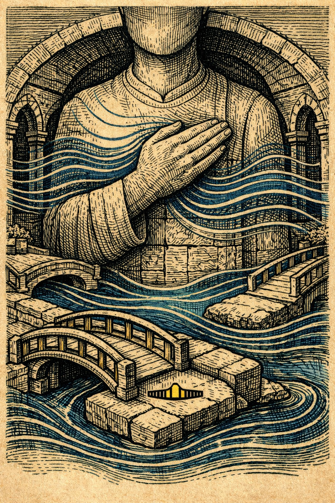

Зовёмся мы Ладомир и рассказываем не точками а дыханием потому что наша правда не прыгает а течёт и утро у нас начинается с зануления когда квартал кладёт ладонь на грудь и слушает что в нём шумит без повода затем мягкая волна проходит по галереям резонанса и мостки проглатывают чужую торопливость

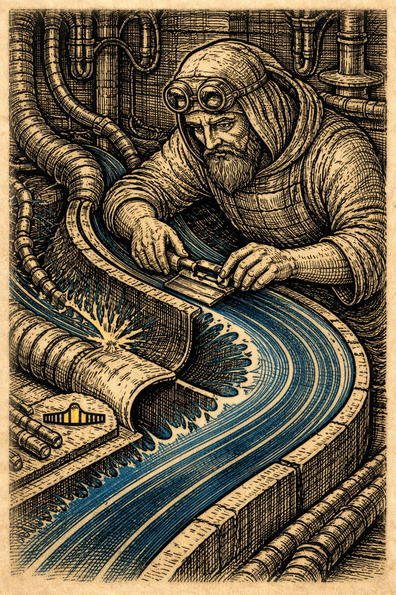

и Контурники скругляют острые места речи и тока

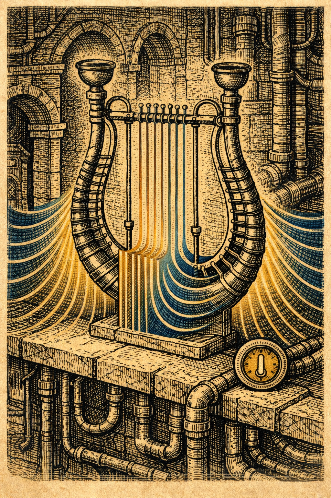

и Термолиры проверяют террасы садов температур чтобы тепло не сорвалось с полки на голову соседу

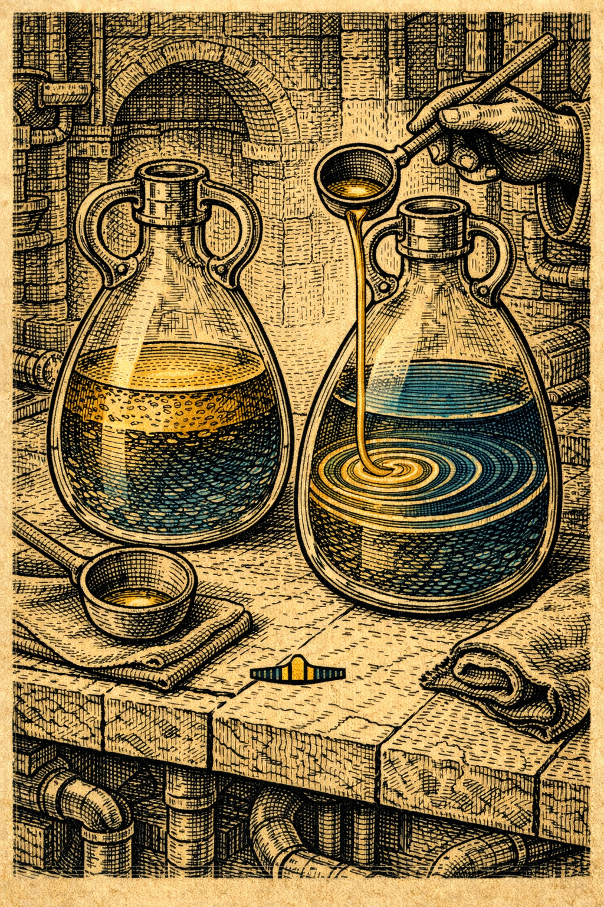

и Потокари в своих стеклянных мастерских переливают воду и масло пока ответ встаёт как хорошо вымешанное тесто

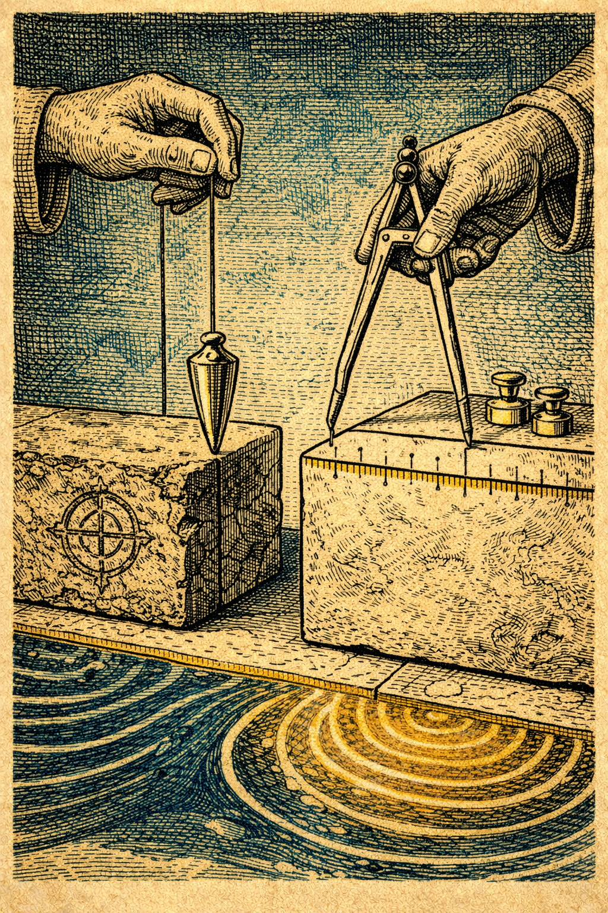

и Эталонники медленно переносят правду со старого камня на новую шкалу

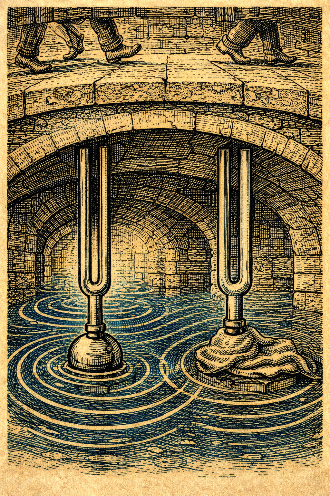

и Камертоны внизу пробуют ноту квартала и если под ними топают они обижаются и глохнут и тогда все начинают говорить шёпотом

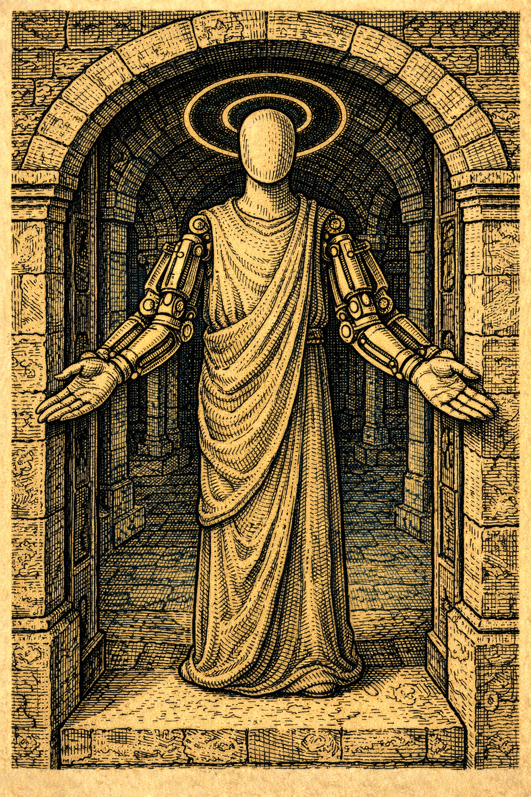

и Серво-Ангел стоит на пороге и говорит не спешите я подержу пока вы вспоминаете руки

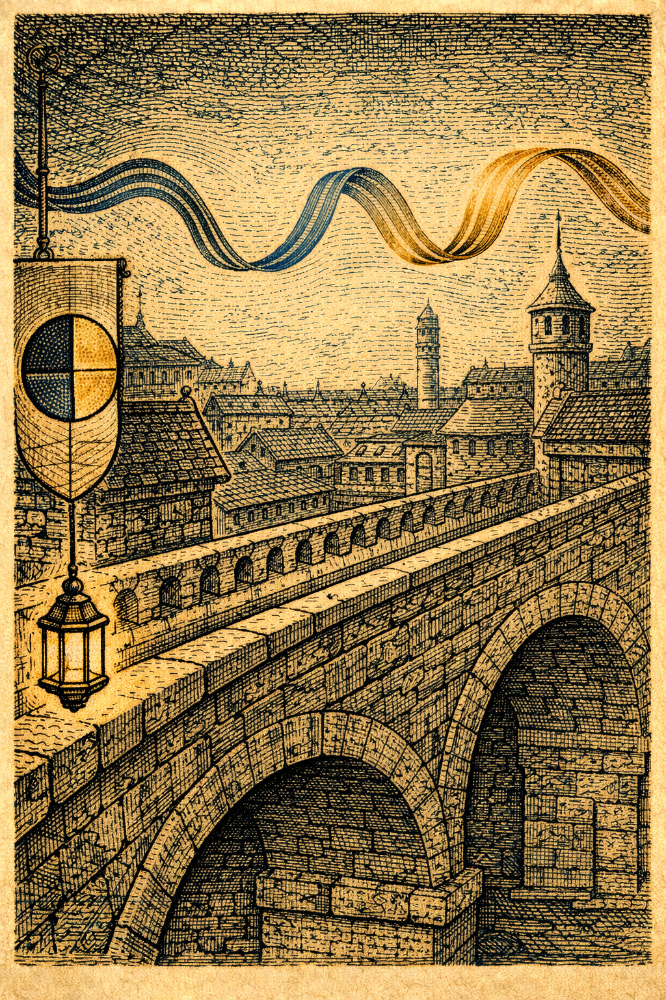

и вот в такой ровный час приходит весть что на вечер назначена Ночь Длинной Ноты

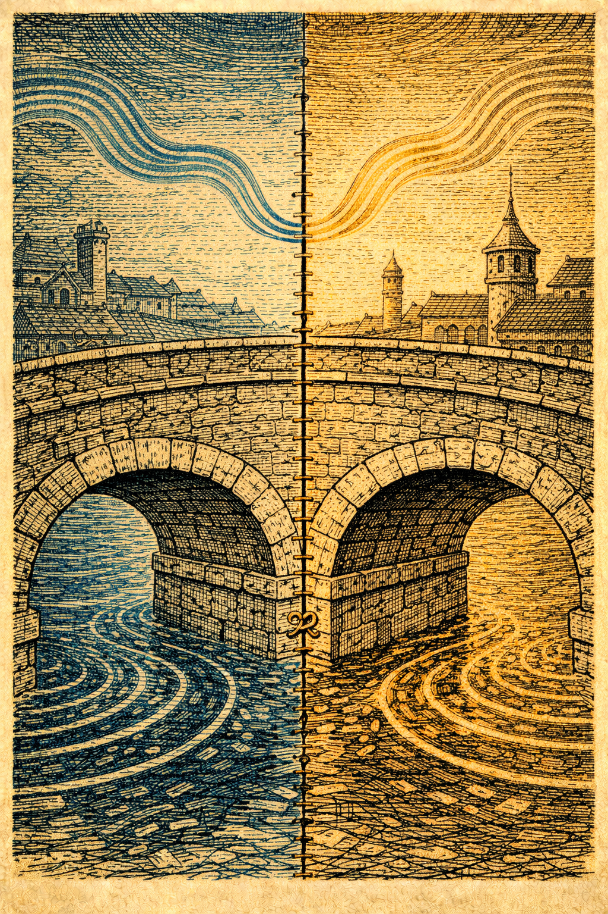

а на границе Квантариум готовит Свадьбу Пары а в Тактополисе заводят Карнавал Фронтов и мост Стежок уже шевелит своими двумя временами обещая полдолю молчания в сердце строя

а мы готовим наш вклад в общий мир потому что любовь по нашему произносится огибающей и мы вместо громких тостов шьём швы и кладём демпферы будто пледы на чужие плечи

днём в клуатрах Ладильники протирают ручки ЛАД чтобы вечером вести ансамбль ферм как хор без крика и Фоно-Кузнецы куют мягкие клинья в стыки и Термолиры уговаривают радиаторы отдавать лишнее шёпотом а не всплеском и города соседей присылают свои просьбы Тактополис просит скруглить пуск для колонны фронтов чтобы без гордыни и без бахвальства а Квантариум просит кордон без сетей живой шов потому что им важней не слово а тишина перед словом и мы киваем и отвечаем как умеем то есть делами

к сумеркам на ветру начинают пряно пахнуть мхи демпферы ламповики вешают в клуатре табличку обет ЛАДа не исправляй быстрее чем понимаешь и наш юный Ладильник по имени Мостина кладёт пальцы на ремень и слышит как квартал дышит а Серво-Ангел осторожно поворачивает, чтобы тёплая рука города не сжала тонкое место и Потокари ставят в проходах чаши с течением ведь иногда чтобы объяснить сложное достаточно показать как вода не спорит с изгибом камня

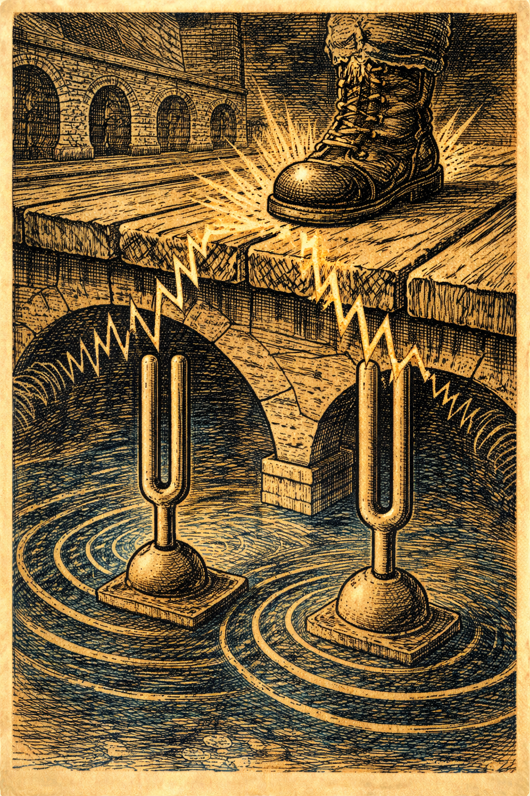

но в самый час когда Ночь должна потянуться длинной нотой приходит резкий посторонний шаг и мостки дрожат и Камертоны морщатся и в тени слышно как жгучая привычка Жаровен рвётся в праздник со своими рывками потому что кому-то показалось что чужая тишина это даром и можно взять её взаймы без просьбы и вернуть когда-нибудь а мы знаем цену переноса и у нас в горле поднимается стыд за чужую боль и Ладильники жестом рука на ЛАД просят паузы и Серво-Ангел говорит я подержу

а Фоно-Кузнецы выбрасывают в стык мягкий клин чтобы удар распался на безопасные волны и всё же удар идёт второй раз и квартал близко к срыву и тогда мы зовём Магнитных из соседнего шва

и приходят Доменные Ткачи белобородые как старые схемы и говорят дайте место под квилт и мы расступаемся и они шьют Spin Quiet Quilt одним длинным стежком который помнит путь туда и обратно и в каждую петлю мы вплетаем наш кодекс не дави не торопи возвращай чужим родным

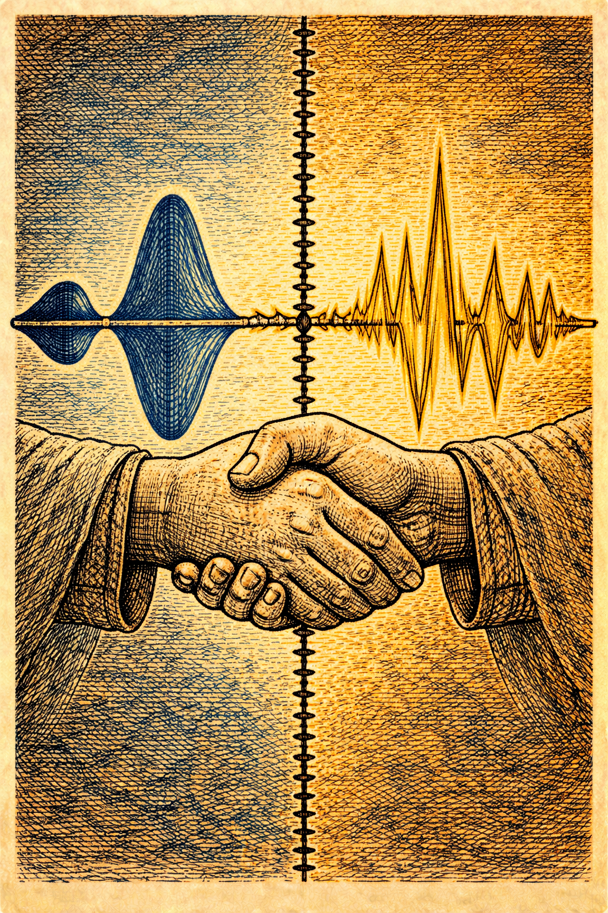

и в это же время мост Стежок уговаривает Ровня в Тактополисе пустить полдолю молчания в сердце строя а Низколун у квантов даёт разрешение на полдолю пульса чтобы память не боялась и когда эти две половины встречаются в шве удар Жаровен не исчезает но превращается в кач который можно держать

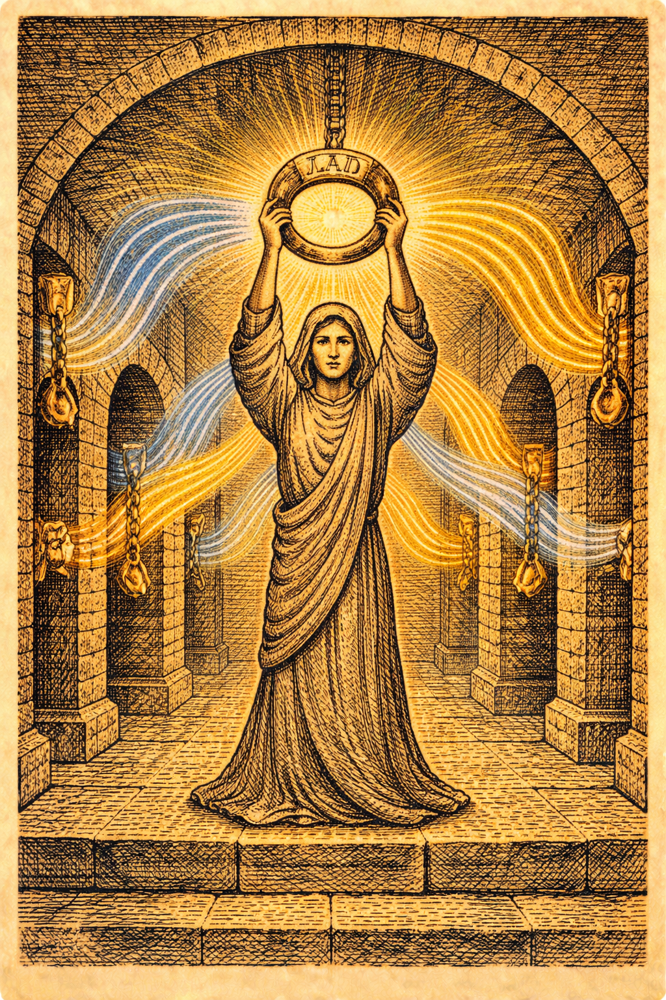

и тогда вступает Мостина наш юный Ладильник она поднимает ЛАД как дирижёра и ведёт ансамбль резонансов через пролёт и мы слышим как квартал собирается в песню и острые края приглушаются и междометия из железа превращаются в согласные

и на границе видно как у Квантариума снег метастабильностей ложится ровно словно кто-то поправил покрывало на постели

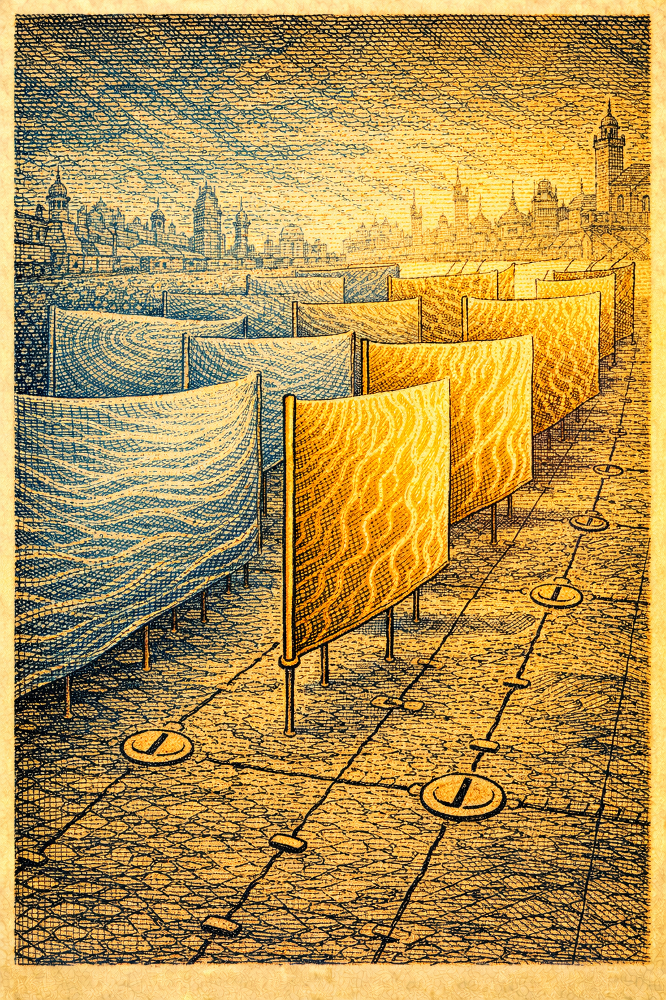

а у Тактополиса фронты идут гордо но без тщеславия шаг полдоля шаг и Шорох каскадёр ловит чужие дрожи и смеётся ни один гость не уронит тарелку сегодня

мы ведём Ночь Длинной Ноты до самой глубины когда дыхание стало общим а руки помнят что они сделаны чтобы удерживать а не хватать и вместе с нами в темноту входят соседи Гелиописцы снимают лишний свет чтобы вкус голосов стал гуще Магнитные гладят шов чтобы он не перетянул и где-то на радиаторной кромке Пастырь плазмонный шипит мягко заштопывая крохотную язву и мы слышим как исчезает риск расползания и с ним уходит людоедское ощущение что всё сейчас рухнет потому что у падения вдруг появился путь стать шагом

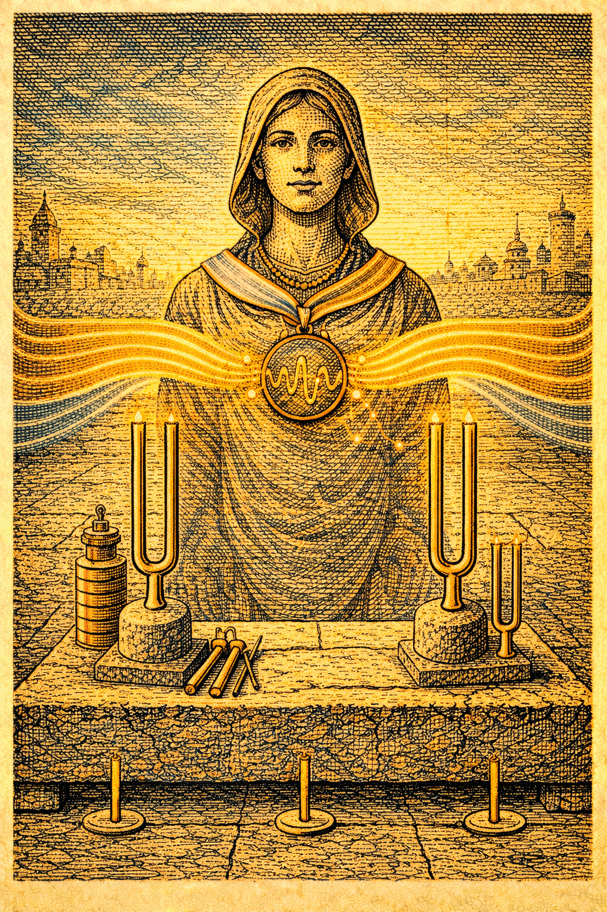

к утру мы устраиваем Пир Калибров Эталонники выкатывают опоры Камертоны отвечают чистыми нотами Мостине вешают на шею ленту огибающей и Она кланяется полупоклон полушаг обещая вести не быстрее чем понимает

а Жаровни присылают через Коммонс капсулу намерений в которой наконец написано чужим родным вернём шум тишиной вернём тепло холодом вернём долги в сезон и мы принимаем её потому что лучше поздний стыд чем повторный перенос

в полдень мы идём в Ширь где Кухни Радиатора обжигают шёпотом стейки для тех кто отработал ночной кордон и мы едим без звона ножей и смеёмся тихо и дети из школ Лёгкой Ноги бегут по мосткам и мостки не возражают и в этом смехе жилы ∇T текут как реки по своим руслам не заливая соседние луга и Мостина в тени лир учит младших держать ЛАД на весу потому что иногда достаточно грамма мягкости чтобы тонна железа не решила что ей хочется петь на всю мощность

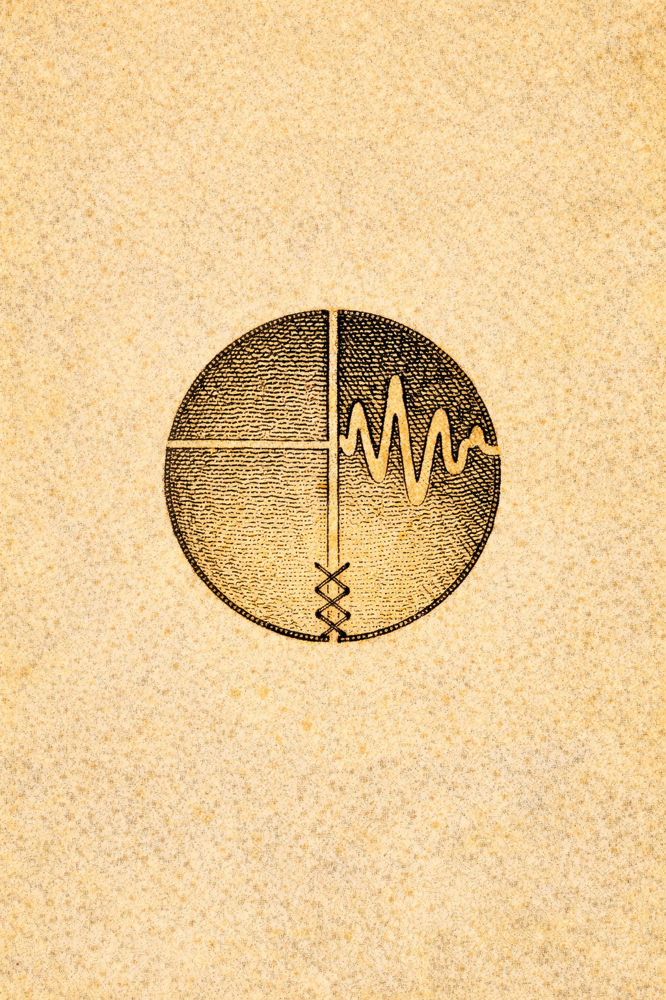

к вечеру приходит письмецо от Стежка что Сенат Коммонсов принял наш общий обычай и теперь у праздников будет место под полдолю молчания а у тревог место под полдолю такта и это называется Кодекс Полутакта и это смешное слово становится привычкой лучше всякой инструкции и мы улыбаемся краешком губ потому что у Ладомира не принято кричать победа мы просто проводим рукой по кривой дня и видим что она ровная без стыда за скачки и тогда записываем в Книгу Ручных Регламентов ещё одну историю про то как падение стало шагом и как шов не сделал чужим и как наш голос снова оказался тише того места где тишина дороже и мы продолжаем дышать одной длинной нотой которая не требует точки чтобы быть услышанной

---

[Читать Рецензию](8.analog/review.md)
